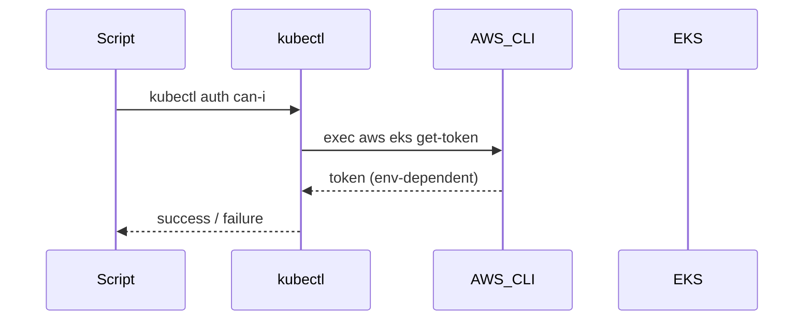

---

# README_WAR_STORIES

A curated list of **non-trivial technical war stories**, capturing real lessons suitable for **senior-level interviews**.

---

## 1. EKS Exec Plugin Authentication Failure in Non-Interactive Contexts

**creation:** `<260118-214500>`
**last_updated:** `<260118-214500>`

**keywords:** AWS, EKS, Kubernetes, kubectl, IAM, exec-plugin
**difficulty:** 7
**significance:** 8

### 1.1 Context

Automated EKS access checks (`kubectl auth can-i`) failed with **“Token check FAILED after refresh”** when executed inside scripts, while identical commands succeeded interactively.

### 1.2 Root Cause

EKS authentication depends on a **kubectl exec plugin** invoking `aws eks get-token`.
In non-interactive shells, required environment variables (e.g. `AWS_PROFILE`) were **not inherited**, causing token generation to fail.

### 1.3 Key Insight

> Apparent EKS auth flakiness is often a deterministic **environment propagation problem**, not an IAM or cluster issue.

### 1.4 Resolution

Explicitly export AWS credential context inside the execution environment used by `kubectl`, and validate auth from the same process context.

### 1.5 Takeaway

When debugging EKS auth, always test **where the process runs**, not where the command works.

### 1.6 Diagram

