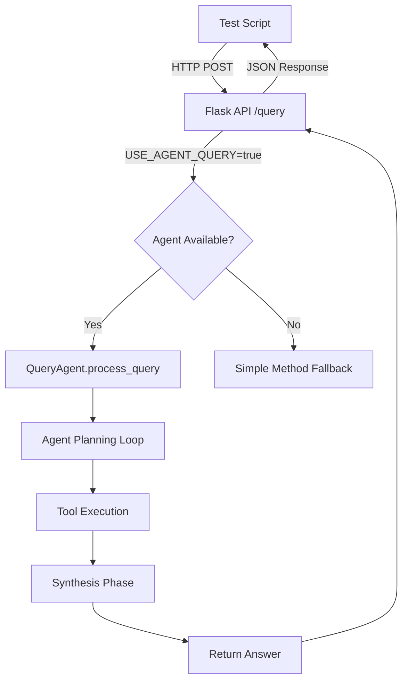
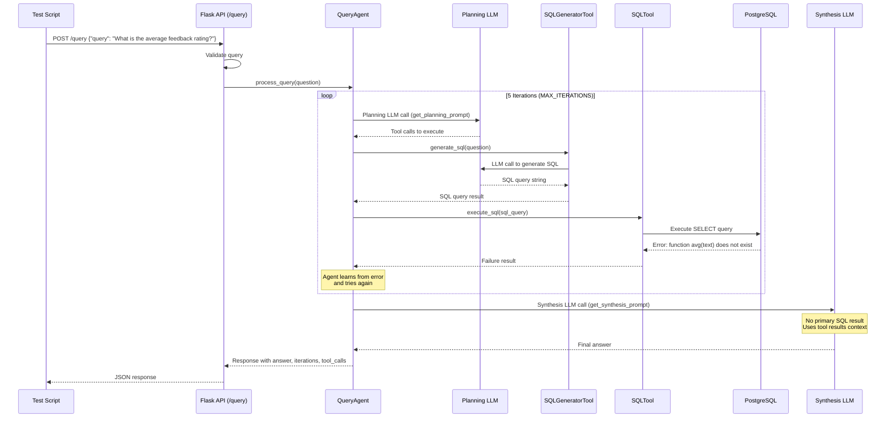
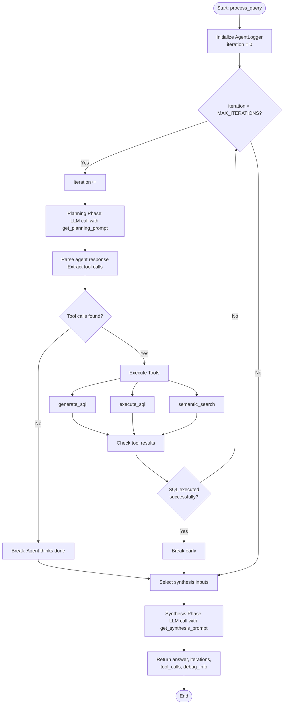
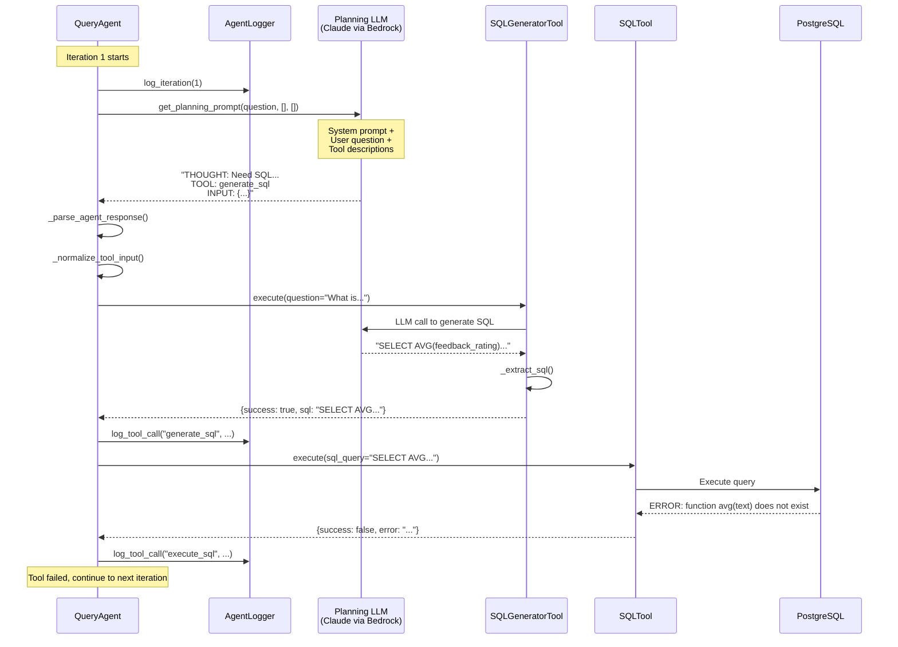
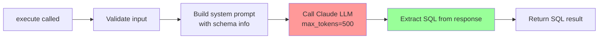
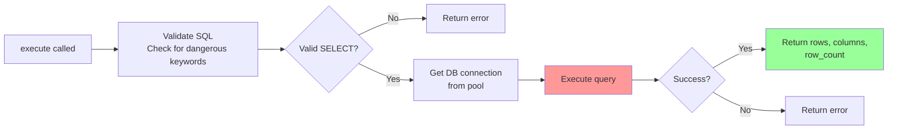
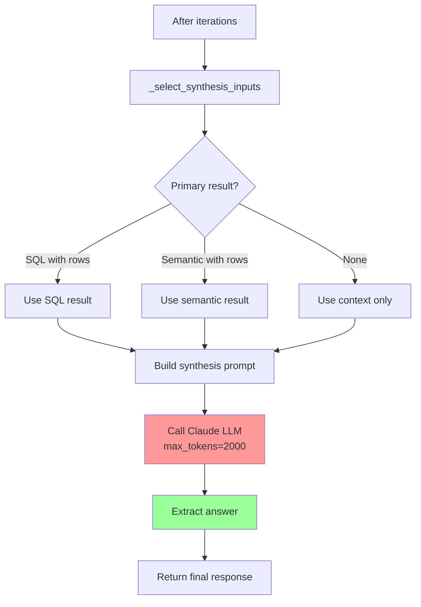
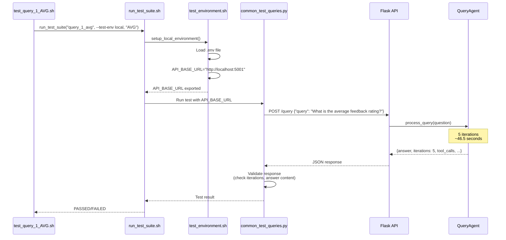

# Local Test Logic Flow - Agent-Based Query Processing

## Overview

This document describes the logic flow during a local test execution using the agent-based query processing system. The test `./test/test_query_1_AVG.sh --test-env local` queries "What is the average feedback rating?" and takes ~47 seconds.

## Agent Location

The agent code is located in:
- **Main Agent**: `backend/agents/query_agent.py` - `QueryAgent` class
- **Tools**: `backend/agents/tools/` - SQLTool, SemanticSearchTool, SQLGeneratorTool
- **Prompts**: `backend/agents/prompts.py` - System prompts and planning/synthesis prompts
- **Logger**: `backend/agents/logger.py` - `AgentLogger` for structured logging
- **API Integration**: `backend/api/app.py` - `/query` endpoint (lines 495-550)

## High-Level Architecture



## Complete Request Flow



## Agent Processing Loop (ReAct Pattern)



## Detailed Iteration Flow (Example: Iteration 1)



## Tool Execution Details

### SQLGeneratorTool Flow



### SQLTool Flow



## Synthesis Phase



## Test Execution Flow



## Time Breakdown (47 seconds)

```mermaid
gantt
    title Agent Processing Timeline (47s total)
    dateFormat X
    axisFormat %Ls
    
    section Iteration 1
    Planning LLM call     :0, 7200
    generate_sql LLM      :7200, 1500
    execute_sql (failed)  :8700, 7
    
    section Iteration 2
    Planning LLM call     :8707, 7900
    generate_sql LLM      :16607, 1600
    execute_sql (failed)  :18207, 2
    
    section Iteration 3
    Planning LLM call     :18209, 1600
    generate_sql LLM      :19809, 1500
    execute_sql (failed)  :21309, 0
    
    section Iteration 4
    Planning LLM call     :21309, 17300
    generate_sql LLM      :38609, 2000
    execute_sql (failed)  :40609, 15
    
    section Iteration 5
    Planning LLM call     :40624, 8900
    generate_sql LLM      :49524, 1500
    execute_sql (failed)  :51024, 1
    
    section Synthesis
    Synthesis LLM call    :51025, 3600
```



## Key Components

### 1. QueryAgent (`backend/agents/query_agent.py`)

**Main Method**: `process_query(question: str) -> Dict[str, Any]`

**Key Attributes**:
- `MAX_ITERATIONS = 5` - Maximum planning iterations
- `tools` - Dictionary of available tools (execute_sql, semantic_search, generate_sql)
- `system_prompt` - System prompt with tool descriptions

**Process**:
1. Initialize `AgentLogger` for structured logging
2. **Planning Loop** (up to 5 iterations):
   - Call planning LLM with `get_planning_prompt()`
   - Parse agent response to extract tool calls
   - Execute tools in sequence
   - Break early if SQL execution succeeds
3. **Synthesis Phase**:
   - Select primary result (SQL or semantic search)
   - Build synthesis prompt with results
   - Call synthesis LLM with `get_synthesis_prompt()`
   - Return final answer

### 2. Tools

#### SQLGeneratorTool (`backend/agents/tools/sql_generator_tool.py`)
- **Purpose**: Generate SQL queries from natural language
- **Method**: `execute(question: str) -> Dict[str, Any]`
- **Process**: LLM call → Extract SQL → Return SQL string

#### SQLTool (`backend/agents/tools/sql_tool.py`)
- **Purpose**: Execute SQL queries safely
- **Method**: `execute(sql_query: str) -> Dict[str, Any]`
- **Validation**: Blocks dangerous keywords, only allows SELECT
- **Process**: Validate → Execute → Return rows/error

#### SemanticSearchTool (`backend/agents/tools/semantic_search_tool.py`)
- **Purpose**: Semantic search using pgvector
- **Method**: `execute(query_text: str, filters: Dict) -> Dict[str, Any]`
- **Process**: Generate embedding → Vector search → Return similar records

### 3. Prompts (`backend/agents/prompts.py`)

- **`get_agent_system_prompt()`**: System prompt with tool descriptions and guidelines
- **`get_planning_prompt()`**: Prompt for planning phase (what tools to use)
- **`get_synthesis_prompt()`**: Prompt for synthesis phase (generate final answer)

### 4. AgentLogger (`backend/agents/logger.py`)

Tracks:
- Query ID (UUID)
- Iterations
- Tool calls (input/output/timing)
- Agent thoughts
- Execution time

## Issue Analysis: Why 5 Iterations?

The agent went through all 5 iterations because:

1. **Type Error**: `feedback_rating` column is stored as TEXT in some cases, but AVG() requires numeric
2. **SQL Generation**: LLM kept generating `SELECT AVG(feedback_rating)` without type casting
3. **Error Recovery**: Agent tried to fix the error but didn't understand the root cause
4. **Final Synthesis**: Since no SQL succeeded, synthesis used tool results context to generate answer

**Error Pattern**:
```
Iteration 1-5: SELECT AVG(feedback_rating) → Error: function avg(text) does not exist
```

**Solution Needed**: 
- Fix schema info to indicate `feedback_rating` needs casting: `AVG(CAST(feedback_rating AS INTEGER))`
- Or update prompts to emphasize type casting for aggregation functions

## Performance Comparison

| Metric | Local (Docker) | AWS (ECS) |
|--------|---------------|-----------|
| **Total Time** | 47s | ~10s |
| **Planning Calls** | 5 × ~7-9s = ~35-40s | Likely 1-2 iterations |
| **generate_sql Calls** | 5 × ~1.5-2s = ~8s | Likely 1-2 calls |
| **Synthesis** | ~3.6s | ~3-4s |
| **Network Latency** | ~500ms-1s per LLM call | ~50-200ms per call |
| **Root Cause** | SQL type errors → 5 iterations | Better SQL generation → fewer iterations |

## Files Reference

- **Agent**: `backend/agents/query_agent.py`
- **API Endpoint**: `backend/api/app.py` (lines 495-550)
- **Tools**: `backend/agents/tools/`
- **Prompts**: `backend/agents/prompts.py`
- **Test Script**: `test/test_query_1_AVG.sh`
- **Test Runner**: `test/common_sh/run_test_suite.sh`
- **Test Environment**: `test/common_sh/test_environment.sh`

