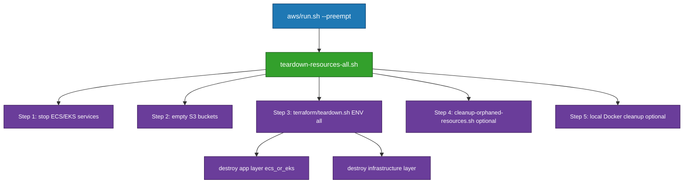

# AWS Teardown Scripts Reference

This document explains each teardown script, their purpose, usage, and relationships. Scripts are ordered from lowest-level (Terraform-specific) to highest-level (orchestrator).

---

## 1. terraform/teardown.sh

**Description**: Low-level Terraform/Terragrunt destroy wrapper. Destroys Terraform-managed infrastructure layers using `terragrunt destroy`, handling dependency ordering (application before infrastructure) and auto-confirming when `PREEMPT=true`.

**Usage**:
```bash
./run_scripts/main_application_scripts/aws/terraform/teardown.sh <ENVIRONMENT> <LAYER>
```

**Parameters**:
- `ENVIRONMENT`: `dev` or `prod`
- `LAYER`: `infrastructure` | `ecs` | `eks` | `all`

**Example**:
```bash
./run_scripts/main_application_scripts/aws/terraform/teardown.sh dev eks
```

**Relationships**:
- **Called by**: `teardown-resources-all.sh` (single call with `LAYER=all` and `CONTAINER_TYPE` set; destroys app layer then infrastructure). Also callable directly by `teardown-resources-nonshared.sh` / `teardown-resources-shared.sh` for partial teardown.
- **Calls**: Terragrunt/Terraform directly
- **Note**: Only destroys Terraform-managed resources. Does not stop services, empty S3 buckets, or clean orphaned resources.

---

## 2. delete-recreatable-resources.sh

**Description**: Standalone CLI tool for "nuclear" teardown of all recreatable AWS resources for a specific environment. Deletes ECS clusters/services, ECR repositories (all images), S3 buckets (except state bucket), CloudFront distributions, ALB/ELB load balancers, VPC resources, and Aurora clusters. Preserves Secrets Manager secrets and Terraform state bucket.

**Usage**:
```bash
./run_scripts/main_application_scripts/aws/shared/cli/resource-removal/older/delete-recreatable-resources.sh <ENVIRONMENT> [--dry-run] [--skip-confirmation]
```

**Options**:
- `--dry-run`: Preview without deleting
- `--skip-confirmation`: Skip prompts (auto-confirms when `PREEMPT=true`)

**Example**:
```bash
./run_scripts/main_application_scripts/aws/shared/cli/resource-removal/older/delete-recreatable-resources.sh dev --skip-confirmation
```

**Relationships**:
- **Called by**: None (standalone CLI tool - run manually when needed)
- **Calls**: AWS CLI directly
- **Note**: This script is NOT called by teardown orchestrators. For automated teardown, use `teardown-resources-all.sh` which calls `cleanup-orphaned-resources.sh` (selective cleanup with retention policies) instead.

---

## 3. teardown-resources-nonshared.sh

**Description**: Destroys **container-type specific infrastructure** (ECS OR EKS) while preserving **shared infrastructure** (VPC, Aurora, IAM, Secrets Manager). It is responsible for tearing down the application stack for a single container orchestrator and cleaning up its direct leftovers.

**Key responsibilities**:
- Stop ECS/EKS services and tasks for the selected container type (scale services to 0, wait for tasks to stop).
- Empty application S3 buckets (analytics and frontend) so Terraform can destroy them cleanly.
- Call `terraform/teardown.sh <ENV> <ecs|eks>` to destroy the container-type Terraform layer (cluster, ALB, frontend, etc.).
- Clean up local Docker images built for ECR (`fru-api` and ECR-tagged variants).
- Run `cleanup-orphaned-resources.sh --cont-sys <ecs|eks>` to:
  - Identify and delete project S3 buckets not managed by Terraform (and not used by CloudFront).
  - Delete old/unused ECR images for the app repo (respecting retention + “keep N latest” rules).
  - Deregister old ECS task definitions beyond the rollback-safety window.

**Usage**:
```bash
./run_scripts/main_application_scripts/aws/shared/resources_cleanup/teardown-resources-nonshared.sh <ENVIRONMENT> --container-type <ecs|eks> [OPTIONS]
```

**Required Parameters**:
- `ENVIRONMENT`: `dev`, `staging`, or `prod`
- `--container-type`: `ecs` or `eks`

**Options**:
- `--force`: Skip confirmation prompts
- `--dry-run`: Preview changes
- `--clean-local-only`: Only clean local Docker images (skip AWS teardown)

**Example**:
```bash
./run_scripts/main_application_scripts/aws/shared/resources_cleanup/teardown-resources-nonshared.sh dev --container-type eks --force
```

**Relationships**:
- **Called by**: Manual/partial teardown only (not used by `teardown-resources-all.sh` in the main flow). Use when you want to destroy only the container-type layer (ECS or EKS) while preserving shared infrastructure.
- **Calls**: `terraform/teardown.sh` (container-type layer), `cleanup-orphaned-resources.sh` (orphan cleanup)

---

## 4. teardown-resources-shared.sh

**Description**: Destroys the **shared infrastructure layer** (VPC, Aurora, IAM, Secrets Manager) and then runs a **shared-layer orphan cleanup** pass. It is a thin wrapper around `terraform/teardown.sh <ENV> infrastructure` followed by `cleanup-orphaned-resources.sh`, and is intended to be called by `teardown-resources-all.sh` for the second (shared) phase of a full teardown.

**Key responsibilities**:
- Call `terraform/teardown.sh <ENV> infrastructure` to destroy VPC, subnets, gateways, security groups, Aurora, IAM, and related shared resources.
- Respect `PREEMPT=true` via the underlying Terraform script (non-interactive Terragrunt).
- Run `cleanup-orphaned-resources.sh --environment <ENV>` as a **shared-layer pass** to catch any remaining:
  - Project S3 buckets not managed by Terraform and not referenced by CloudFront.
  - Old/unused ECR images that only become orphaned after shared infra deletion.
  - ECS-related metadata that might remain in the account after shared teardown.

**Usage**:
```bash
./run_scripts/main_application_scripts/aws/shared/resources_cleanup/teardown-resources-shared.sh <ENVIRONMENT> [--force] [--dry-run]
```

**Required Parameters**:
- `ENVIRONMENT`: `dev`, `staging`, or `prod`

**Options**:
- `--force`: Skip confirmation prompts for orphan cleanup (maps to `--force` for `cleanup-orphaned-resources.sh`)
- `--dry-run`: Preview changes without destroying resources

**Example**:
```bash
./run_scripts/main_application_scripts/aws/shared/resources_cleanup/teardown-resources-shared.sh dev --force
```

**Relationships**:
- **Called by**: Manual/partial teardown only (not used by `teardown-resources-all.sh` in the main flow). Use when you want to destroy only the shared infrastructure layer (VPC, Aurora, IAM) after container layers are already gone.
- **Calls**: `terraform/teardown.sh` (infrastructure layer), `cleanup-orphaned-resources.sh` (orphan cleanup – shared-layer pass)

---

## 5. teardown-resources-all.sh

**Description**: **Single slim orchestrator** for complete infrastructure destruction. Steps: (1) Stop ECS/EKS services and empty S3 buckets (pre-destroy), (2) Run `terraform/teardown.sh <ENV> all` once (destroys app layer then infrastructure in dependency order), (3) Optional orphan cleanup, (4) Optional local Docker image cleanup. No long VPC/Aurora waits in the happy path; rely on Terraform destroy order. If infrastructure destroy fails (e.g. ENI eventual consistency), retry later or use `remove-all-aws-resources` as fallback (see README_TERRA_SH_RESPONSIBILITIES.md and README_WAR_STORIES.md). Preserves Secrets Manager secrets (lifecycle.prevent_destroy).

**Usage**:
```bash
./run_scripts/main_application_scripts/aws/shared/resources_cleanup/teardown-resources-all.sh <ENVIRONMENT> --container-type <ecs|eks> [OPTIONS]
```

**Required Parameters**:
- `ENVIRONMENT`: `dev`, `staging`, or `prod`
- `--container-type`: `ecs` or `eks`

**Options**:
- `--force`: Skip confirmation prompts
- `--dry-run`: Preview changes
- `--clean-local-only`: Only clean local Docker images (skip AWS teardown)

**Example**:
```bash
./run_scripts/main_application_scripts/aws/shared/resources_cleanup/teardown-resources-all.sh dev --container-type eks --force
```

**Relationships**:
- **Called by**: `aws/run.sh` (when `--preempt` flag is used)
- **Calls**: `terraform/teardown.sh <ENV> all` (single call; app layer then infrastructure), `cleanup-orphaned-resources.sh` (optional, after Terraform), local Docker cleanup (optional)
- **Architecture**: Pre-destroy (stop services, empty S3) → Terraform destroy (app then infra) → optional orphan cleanup → optional local Docker. `teardown-resources-nonshared.sh` and `teardown-resources-shared.sh` are **not** used by this flow; they remain available for partial teardown (container-only or shared-only) when run manually.

---

## 6. aws/run.sh

**Description**: Main orchestrator script for AWS deployments. When `--preempt` is used, calls `teardown-resources-all.sh` to destroy all infrastructure before deployment, ensures non-interactive execution (auto-confirms all prompts), then proceeds with fresh deployment. Orchestrates complete deployment pipeline (teardown → infrastructure setup → application deployment → verification). Suitable for CI/CD pipelines.

**Usage**:
```bash
./run_scripts/main_application_scripts/aws/run.sh deploy --container-type <ecs|eks> <ENVIRONMENT> [--preempt] [--dry-run]
```

**Required Parameters**:
- `deploy`: Action (deploy, verify, etc.)
- `--container-type`: `ecs` or `eks`
- `ENVIRONMENT`: `dev`, `staging`, or `prod`

**Options**:
- `--preempt`: Destroy all infrastructure before deployment (calls `teardown-resources-all.sh`)
- `--dry-run`: Preview changes without modifying resources

**Example**:
```bash
./run_scripts/main_application_scripts/aws/run.sh deploy --container-type eks dev --preempt
```

**Relationships**:
- **Calls**: `teardown-resources-all.sh` (when `--preempt` is used)
- **Orchestrates**: Complete deployment pipeline

---

## Script Call Hierarchy

**Main flow (slim orchestrator):**



---

## Quick Reference

| Use Case | Script | Example |
|----------|--------|---------|
| Destroy EKS only (preserve ECS + shared) | `teardown-resources-nonshared.sh` | `teardown-resources-nonshared.sh dev --container-type eks --force` |
| Destroy everything (complete teardown) | `teardown-resources-all.sh` | `teardown-resources-all.sh dev --container-type eks --force` |
| Nuclear teardown (all recreatable resources) | `delete-recreatable-resources.sh` | `delete-recreatable-resources.sh dev --skip-confirmation` |
| Clean up orphaned resources only | `cleanup-orphaned-resources.sh` | `cleanup-orphaned-resources.sh --environment dev --force` |
| Destroy Terraform layer directly | `terraform/teardown.sh` | `terraform/teardown.sh dev infrastructure` |
| Complete teardown + deploy | `aws/run.sh --preempt` | `aws/run.sh deploy --container-type eks dev --preempt` |

---

## Effect of --preempt Flag

When `--preempt` is used with `aws/run.sh`:

1. **Non-Interactive**: All confirmation prompts skipped (auto-confirmed)
2. **Complete Teardown**: Calls `teardown-resources-all.sh` which destroys container-type resources, shared infrastructure (VPC, Aurora, IAM), S3 buckets, local Docker images, and orphaned resources
3. **Fresh Deployment**: After teardown, proceeds with full deployment pipeline
4. **CI/CD Ready**: Suitable for automated pipelines (no manual intervention)

**Preserved**: Secrets Manager secrets (30-day recovery window), Terraform state bucket

**Example**:
```bash
./run_scripts/main_application_scripts/aws/run.sh deploy --container-type eks dev --preempt
```

---

## Notes

- All scripts support `--dry-run` to preview changes
- Use `--force` to skip confirmation prompts (or rely on `PREEMPT=true` for non-interactive mode)
- Scripts are idempotent: safe to run multiple times
- Terraform state bucket is never destroyed (by design)
- Secrets Manager secrets are preserved (30-day recovery window)
