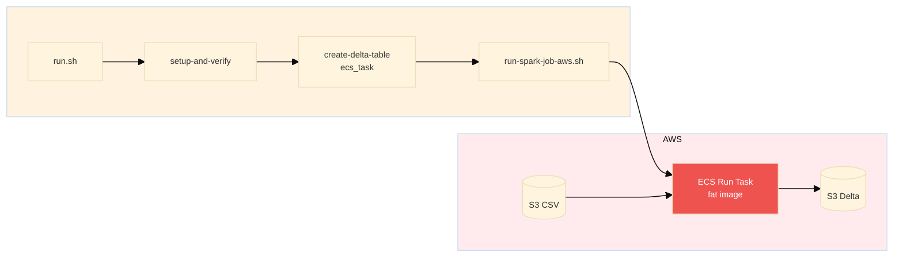
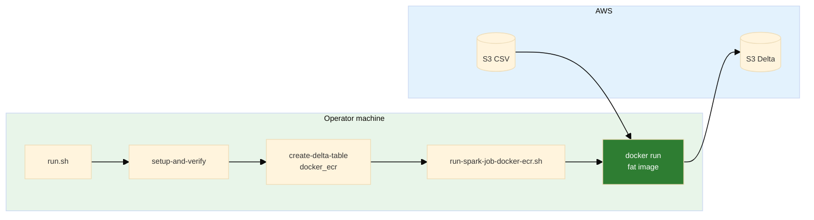

# README_WAR_STORIES

A curated list of **non-trivial technical war stories**, capturing real lessons suitable for **senior-level interviews**.

---

## 1. HTTP Status Code Corruption: Streaming Endpoint Validation with HEAD vs GET

**creation:** `<260127-175946>`
**last_updated:** `<260127-175946>`

**keywords:** HTTP, curl, streaming endpoints, Server-Sent Events (SSE), status code validation, HEAD request
**difficulty:** 6
**significance:** 7

### 1.1 Context

During automated endpoint validation, the `/query/stream` endpoint (a Server-Sent Events streaming endpoint) consistently returned a corrupted HTTP status code: `HTTP 200000` instead of the expected `HTTP 200`. The validation script used `curl -w "%{http_code}"` with a GET request, which worked fine for regular REST endpoints but failed for streaming endpoints.

### 1.2 Root Cause

The `/query/stream` endpoint streams data continuously using Server-Sent Events (SSE). When using `curl -w "%{http_code}"` with a GET request, curl:
1. Sends the GET request
2. Receives the HTTP response headers (including status code)
3. **Starts consuming the streaming response body**
4. Tries to write the status code to stdout

The problem: The streaming data output mixed with the status code output, resulting in a corrupted value like `200000` (the actual `200` status code followed by streaming data characters that were interpreted as part of the status code).

### 1.3 Key Insight

> Streaming endpoints require different validation strategies than regular REST endpoints. GET requests consume the stream, corrupting output parsing. HEAD requests retrieve only headers without consuming the response body.

### 1.4 Resolution

Changed the validation logic for streaming endpoints from GET to HEAD request:
- **Before:** `curl -s -o /dev/null -w "%{http_code}" "$endpoint"`
- **After:** `curl -s -I -o /dev/null -w "%{http_code}" "$endpoint"`

The `-I` flag (HEAD request) retrieves only the HTTP headers without consuming the response body, allowing clean status code extraction. Added robust extraction logic: `query_stream_status=$(echo "$curl_output" | grep -oE '[0-9]{3}' | head -1 || echo "000")` to handle edge cases.

### 1.5 Takeaway

Always use HEAD requests (`curl -I`) for status validation of streaming endpoints. GET requests will consume the stream and corrupt output parsing. For regular REST endpoints, GET is fine, but streaming endpoints (SSE, WebSockets, long-polling) require HEAD requests for validation.

---

## 2. HTTP 000000 Error: HTTPS vs HTTP Protocol Mismatch for EKS Network Load Balancer

**creation:** `<260127-175946>`
**last_updated:** `<260127-175946>`

**keywords:** AWS EKS, Network Load Balancer (NLB), HTTPS, HTTP, SSL certificate, curl, ingress
**difficulty:** 7
**significance:** 8

### 2.1 Context

During endpoint validation, direct API endpoint checks for EKS ingress endpoints (DNS names like `*.elb.us-east-1.amazonaws.com`) consistently returned `HTTP 000000` errors. CloudFront endpoints worked fine, but the direct load balancer endpoint failed validation. The error appeared as a warning: `[WARNING] ⚠ API endpoint returned HTTP 000000`.

### 2.2 Root Cause

The code was attempting HTTPS connections to EKS ingress endpoints, but EKS uses NGINX Ingress Controller which creates an AWS Network Load Balancer (NLB). NLBs don't have SSL certificates by default unless explicitly configured with AWS Certificate Manager (ACM). 

When `curl` attempted an HTTPS connection to an NLB without a valid certificate:
1. SSL handshake failed
2. `curl` returned exit code 60 (SSL certificate problem)
3. The status code extraction returned `000` (indicating no HTTP response was received)
4. The display logic showed this as `000000` (due to formatting)

The `000` status code from curl is not an HTTP status code—it indicates that curl never received an HTTP response because the SSL/TLS handshake failed before any HTTP communication occurred.

### 2.3 Key Insight

> NLBs and ALBs without ACM certificates don't serve HTTPS with valid certificates. The `000` curl status code indicates SSL handshake failure, not an HTTP protocol error. Always use HTTP for AWS load balancer DNS names unless you've explicitly configured ACM certificates.

### 2.4 Resolution

Modified `fetch-deployment-info.sh` to always use `http://` when constructing API URLs for EKS ingress hostnames (which are NLB DNS names ending in `.elb.amazonaws.com`):

```bash
# Before: Conditional HTTPS/HTTP based on hostname pattern
if echo "$K8S_INGRESS_HOST" | grep -qE '\\.elb\\.|\\.amazonaws\\.com'; then
    API_URL="http://$K8S_INGRESS_HOST"
else
    API_URL="https://$K8S_INGRESS_HOST"  # Wrong assumption
fi

# After: Always HTTP for EKS Ingress (NLB)
API_URL="http://$K8S_INGRESS_HOST"
```

Also fixed the same issue in `test/common_sh/test_environment.sh` which had been overlooked during the initial fix.

### 2.5 Takeaway

Always use HTTP for AWS load balancer DNS names (`.elb.amazonaws.com`) unless you've explicitly configured ACM certificates. The `000` curl status code is a red flag for SSL/TLS issues, not HTTP protocol problems. When debugging endpoint failures, check the protocol first—many "HTTP errors" are actually SSL certificate problems.

---

## 3. CloudFront Invalidation Timeout: Stdout/Stderr Capture Corrupting Return Values

**creation:** `<260127-175946>`
**last_updated:** `<260127-175946>`

**keywords:** Bash, command substitution, stdout, stderr, environment variables, CloudFront, invalidation, function return values
**difficulty:** 8
**significance:** 9

### 3.1 Context

CloudFront invalidation consistently timed out with `NoSuchInvalidation` errors, even though invalidations were being created successfully. The deployment script would:
1. Create a CloudFront invalidation (succeeded)
2. Attempt to wait for completion (failed with `NoSuchInvalidation`)
3. Timeout after 15 minutes
4. Deployment continued, but the invalidation never completed verification

**Why CloudFront Invalidation is Needed:** CloudFront caches content at edge locations worldwide. When you deploy new frontend files to S3, CloudFront continues serving the old cached version until the cache expires (which can take hours or days). Invalidation tells CloudFront to immediately purge cached content and fetch fresh files from the origin (S3). Without invalidation, users see stale content after deployments.

### 3.2 Root Cause

The function `create_cloudfront_invalidation()` was designed to return the invalidation ID via stdout for command substitution:

```bash
invalidation_id=$(create_cloudfront_invalidation "$dist_id" "/*")
```

However, the function also logged messages to stdout using `log_info()` and `log_success()`, which write to stdout. When captured with command substitution, the variable captured **both** the log messages and the invalidation ID:

```
invalidation_id='[INFO] Creating CloudFront invalidation...
[INFO]   Distribution ID: E33TA1D0OAYUNR
[INFO]   Paths: /*
[SUCCESS] CloudFront invalidation created: IAS6QGH99WVY9LQVVST4POTQBE
IAS6QGH99WVY9LQVVST4POTQBE'
```

This corrupted string was then passed to `wait_for_invalidation()`, which called `aws cloudfront get-invalidation --id '[INFO] Creating...IAS6QGH99WVY9LQVVST4POTQBE'`. AWS correctly returned `NoSuchInvalidation` because that malformed string is not a valid invalidation ID.

### 3.3 Key Insight

> Functions that return values via stdout must NEVER log to stdout. Command substitution captures ALL stdout, making it impossible to separate logs from return values. Use stderr for logging, or better yet, use environment variables for values that need to be passed between functions.

### 3.4 Resolution

**Initial Fix Attempt:** Redirected log messages to stderr (`>&2`), which worked but was fragile and error-prone. Any future developer adding a log statement without the redirect would reintroduce the bug.

**Final Solution:** Changed to environment variable pattern, consistent with other deployment scripts in the codebase:

```bash
# Function now sets and exports environment variable
create_cloudfront_invalidation() {
    # ... create invalidation ...
    export CLOUDFRONT_INVALIDATION_ID="$invalidation_id"
    log_success "CloudFront invalidation created: $invalidation_id"
    return 0
}

# Usage becomes simpler and more robust
if create_cloudfront_invalidation "$dist_id" "/*"; then
    wait_for_invalidation "$dist_id" "$CLOUDFRONT_INVALIDATION_ID" 15 "true"
fi
```

This approach:
- Eliminates stdout/stderr separation issues
- Makes the return value explicit (environment variable name)
- Is consistent with other deployment scripts (`fetch-deployment-info.sh` pattern)
- Is more robust (no risk of mixing logs with return values)

### 3.5 Takeaway

When a function is meant to return a value, either: (1) log to stderr only, or (2) use environment variables. Command substitution captures ALL stdout, making it impossible to separate logs from return values. Environment variables are more robust, explicit, and follow Unix conventions (stdout for data, stderr for diagnostics, or use environment for function-to-function communication).

---

## 4. EKS Load Balancer Type Confusion: NLB vs ALB Misunderstanding

**creation:** `<260127-175946>`
**last_updated:** `<260127-175946>`

**keywords:** AWS EKS, AWS Load Balancer Controller, NGINX Ingress Controller, Network Load Balancer (NLB), Application Load Balancer (ALB)
**difficulty:** 5
**significance:** 6

### 4.1 Context

During debugging of the HTTP 000000 error, code comments and analysis incorrectly stated that "EKS uses AWS Load Balancer Controller to create ALBs." However, the project's EKS setup documentation (`docs/README_WORKFLOW_EKS_NOTES.md`) indicated that EKS uses NGINX Ingress Controller, which creates NLBs, not ALBs. This architectural misunderstanding led to incorrect assumptions about SSL certificate configuration.

### 4.2 Root Cause

EKS supports multiple ingress controllers, each creating different types of load balancers:
- **AWS Load Balancer Controller** → Creates Application Load Balancers (ALBs)
- **NGINX Ingress Controller** → Creates Network Load Balancers (NLBs)

The project uses NGINX Ingress Controller, but comments and analysis incorrectly assumed ALB usage. This led to confusion about why SSL certificates weren't working (ALBs can have ACM certificates more easily configured, while NLBs require explicit ACM setup).

### 4.3 Key Insight

> EKS can use different ingress controllers, each creating different load balancer types. Don't assume load balancer types based on platform (EKS vs ECS). Always verify the actual ingress controller and load balancer type in your infrastructure.

### 4.4 Resolution

Updated comments and documentation to correctly reflect NLB usage for EKS:

```bash
# Updated comment in fetch-deployment-info.sh
# EKS Ingress uses NGINX Ingress Controller, which creates an NLB (Network Load Balancer) on AWS.
# NLBs use .elb.amazonaws.com DNS names and don't have SSL certificates by default
# (unless configured with ACM), so always use HTTP.
```

This clarification helped explain why HTTP (not HTTPS) was required for EKS ingress endpoints.

### 4.5 Takeaway

Don't assume load balancer types based on platform (EKS vs ECS). Verify the actual ingress controller and load balancer type in your infrastructure. Different ingress controllers create different load balancer types, and each has different SSL/TLS certificate requirements.

---

## 5. Protocol Inconsistency: HTTPS Used Where HTTP Required for NLB Endpoints

**creation:** `<260127-175946>`
**last_updated:** `<260127-175946>`

**keywords:** HTTPS, HTTP, protocol, EKS, NLB, test files, consistency, SSL certificates, CloudFront
**difficulty:** 4
**significance:** 6

### 5.1 Context

After fixing the HTTP 000000 error in `fetch-deployment-info.sh` by changing EKS ingress URLs from HTTPS to HTTP, the same issue persisted in test files. The test script `test/common_sh/test_environment.sh` was still attempting HTTPS connections to EKS ingress endpoints, causing test failures.

### 5.2 Root Cause

During the initial fix, only the main deployment script (`fetch-deployment-info.sh`) was updated. The test file `test/common_sh/test_environment.sh` contained duplicate logic for constructing API URLs from EKS ingress hostnames, but it wasn't updated. This created an inconsistency where:
- Production deployment scripts used HTTP (correct)
- Test scripts used HTTPS (incorrect)

**Certificate Limitation Explanation:** 
- **Local machine:** Cannot test HTTPS connections to NLB endpoints because NLBs don't have SSL certificates by default. The local machine would need to trust a certificate that doesn't exist, causing SSL handshake failures.
- **Remote (CloudFront):** CloudFront distributions are configured with ACM certificates and serve HTTPS properly. Users access the application via CloudFront's HTTPS endpoint, which then proxies to the backend (NLB) over HTTP internally. The SSL/TLS termination happens at CloudFront, not at the NLB.

This is a common pattern: CloudFront handles HTTPS for end users, while the origin (NLB/ALB) uses HTTP internally. The NLB doesn't need certificates because it's not directly exposed to end users—only CloudFront connects to it.

### 5.3 Key Insight

> When fixing protocol issues, search the entire codebase for similar patterns. Test files and utility scripts often duplicate logic that needs the same fix. Also understand the architecture: CloudFront terminates SSL for end users, while internal load balancers (NLB/ALB) typically use HTTP.

### 5.4 Resolution

Updated `test/common_sh/test_environment.sh` to use `http://` for EKS ingress hostnames, matching the main script behavior:

```bash
# Before (lines 124, 135)
API_URL="https://$K8S_INGRESS_HOST"
API_URL="https://$k8s_ingress"

# After
API_URL="http://$K8S_INGRESS_HOST"
API_URL="http://$k8s_ingress"
```

This ensured consistency across all scripts and fixed test failures.

### 5.5 Takeaway

Always search for similar patterns across the entire codebase when fixing protocol/URL construction issues. Test files are often overlooked but contain duplicate logic that needs the same fix. Understand your architecture: if CloudFront is in front, it handles HTTPS for users while internal load balancers use HTTP. Local testing of NLB endpoints must use HTTP because NLBs don't have certificates; CloudFront provides the HTTPS layer for production users.

---

## 6. VPC Teardown: Dependency Graph and Safe Deletion Order

**creation:** `<260129>`
**last_updated:** `<260129>`

**keywords:** AWS VPC, teardown, dependency order, ENIs, subnets, security groups, load balancers, VPC endpoints, deletion order
**difficulty:** 7
**significance:** 8

### 6.1 Context

During brutal-force AWS resource removal (scripted teardown from a resource-inventory JSON), deletions failed with `DependencyViolation`: subnets could not be deleted ("has dependencies"), security groups could not be deleted ("has a dependent object"), and the VPC could not be deleted ("has dependencies"). The script deleted load balancers, NAT gateways, and internet gateways in an order that seemed logical, but subnet and VPC deletion still failed.

### 6.2 Root Cause

VPC and its resources form a strict dependency graph. Deleting in the wrong order leaves "downstream" resources still referencing "upstream" ones, so AWS correctly refuses to delete. The relevant structure is:

```
VPC
├─ Subnets
│  ├─ ENIs
│  │  ├─ EC2 / ECS / EKS / RDS / ALB / NAT
│  │  └─ VPC Endpoints (interface)
│  └─ Route Tables (subnet associations)
├─ Internet Gateway
├─ NAT Gateways
├─ Load Balancers
├─ VPC Endpoints (gateway)
├─ Security Groups
└─ Network ACLs (rarely block deletion)
```

The script had **no step for ENIs** and **no step for VPC endpoints**. ENIs (network interfaces) are created by ALBs, NAT gateways, EC2, RDS, EKS, etc. They live in subnets and reference security groups. Until those ENIs are gone, you cannot delete the subnet or (in many cases) the security groups. Similarly, VPC endpoints (interface or gateway) must be deleted before the VPC. Deletion must follow a **safe order** that respects this graph.

### 6.3 Key Insight

> VPC teardown is not "delete everything in any order." It is a dependency-aware sequence: remove load balancers and NAT first, then VPC endpoints, then ENIs, then subnets, then route tables (non-main), then security groups (non-default), then internet gateway, then VPC. Missing ENIs or VPC endpoints in your teardown script will cause DependencyViolation and leave the VPC stuck.

### 6.4 Resolution

- **Inventory:** Extended the find-all script to collect **network interfaces (ENIs)** and **VPC endpoints** in non-default VPCs, so the removal script has a full picture.
- **Order:** Implemented removal in this order (steps 1–17): CloudFront → EKS → ECS → RDS → Load balancers → EC2 instances → NAT gateways → Elastic IPs → Internet gateways → **ENIs** → Subnets → Security groups → **VPC endpoints** → VPCs → ECR → S3 → IAM.
- **ENIs before subnets:** Added a dedicated "Network interfaces (ENIs)" step that lists ENIs per VPC from the inventory and deletes them (with special handling for ELB-managed attachments) so subnets and security groups can be deleted afterward.
- **VPC endpoints before VPCs:** Added a "VPC Endpoints" step so interface and gateway endpoints are deleted before attempting VPC deletion.

After these changes, teardown could progress past subnets and security groups once ENIs and VPC endpoints were removed.

### 6.5 Takeaway

Model the VPC dependency graph explicitly and implement teardown in a safe order: Load balancers / NAT → VPC Endpoints → ENIs → Subnets → Route Tables (non-main) → Security Groups (non-default) → Internet Gateway → VPC. Include ENIs and VPC endpoints in both inventory and removal; omitting them is a common cause of DependencyViolation during VPC teardown.

---

## 7. ELB Deletion and ENIs: Eventual Consistency, Not a Bug

**creation:** `<260129>`
**last_updated:** `<260129>`

**keywords:** AWS ELB, ALB, ENI, network interface, eventual consistency, asynchronous deletion, ela-attach, teardown, wait state
**difficulty:** 7
**significance:** 8

### 7.1 Context

After deleting Application Load Balancers (ALBs) during teardown, the script tried to delete remaining network interfaces (ENIs) so subnets and the VPC could be removed. Two ENIs remained, each with an attachment ID like `ela-attach-04fc51a5d84c05f6f` and `InstanceOwnerId: amazon-aws`. The script could not detach them (`OperationNotPermitted: You are not allowed to manage 'ela-attach' attachments`) and could not delete the ENIs while they were attached. Subnet and VPC deletion kept failing with DependencyViolation. In the console, the ENI showed an attachment that didn't link to any visible resource—the ALB was already gone.

### 7.2 Root Cause

**A. Why it doesn't disappear immediately (this is key)**  
ELB deletion is **asynchronous**.

When you delete a load balancer:

1. The **LB object is deleted quickly** (it disappears from the console and API).
2. **Backend cleanup happens later:**
   - Deregister targets  
   - Tear down cross-AZ networking  
   - Drain connections  
   - **Release ENIs**  
3. **ENIs are released last.**  
   AWS does this **eventually-consistent**, not transactional. The ENI and its `ela-attach-*` attachment can remain for several minutes (often 10–30+). During that time the attachment points to an ALB that no longer exists, so the console shows an attachment that "doesn't link to anything." That is expected.

**B. What you should NOT do**

- **Don't try to force-delete the ENI** — it won't work; AWS does not allow you to delete an ENI that still has an ELB-managed attachment.
- **Don't try to delete the subnet yet** — the subnet has dependencies (the ENI) until AWS releases it.
- **Don't recreate/delete the VPC repeatedly** — that doesn't speed up ENI release and can make cleanup noisier.

This is a **wait state**, not a mistake. The system is behaving as designed.

### 7.3 Key Insight

> After you delete an ALB/NLB, its ENIs are released asynchronously by AWS. You cannot detach or force-delete them; you must wait. Treat "ENI still attached (ela-attach) with no visible ELB" as normal eventual consistency. Scripts should either wait with a timeout and retry ENI deletion, or mark ENIs as "pending AWS cleanup" and exit; do not treat it as a fatal error or retry VPC/subnet deletion in a tight loop.

### 7.4 Resolution

- **Detection:** The removal script identifies ELB-managed attachments by `AttachmentId` starting with `ela-attach-` or `InstanceOwnerId` of `amazon-aws` / `amazon-elb`. For these, it does **not** attempt detach (which would fail with OperationNotPermitted).
- **Wait-and-retry:** For such ENIs, the script first tries to delete the ENI; if that fails due to attachment still present, it waits up to 5 minutes, polling every 15 seconds to see if the attachment is gone (AWS released it), then retries delete.
- **Graceful skip:** If the ENI is still attached after the timeout, the script records it as **skipped** with reason `pending_aws_elb_cleanup` and a message that AWS will clean it up in ~10–15 minutes, rather than failing the whole run. A later re-run of the script (or a separate run after waiting) can then delete the ENI and proceed with subnets and VPC.

No code change can make AWS release the ENI sooner; the only correct behavior is to wait or to defer and retry.

### 7.5 Takeaway

ELB deletion is asynchronous; ENIs are released last and can linger for 10–30+ minutes. Do not force-delete the ENI, do not delete the subnet while the ENI exists, and do not treat this as a bug—it is eventual consistency. Implement wait-and-retry with a timeout and/or a "pending cleanup" skip so teardown scripts can either succeed after a wait or be re-run later when AWS has finished cleanup.

---

## 8. Project-Wide venv: One Python, One Place, All Scripts

**creation:** `<260130>`
**last_updated:** `<260130>`

**keywords:** Python, venv, virtual environment, PYTHON_CMD, load-env, boto3, run scripts, dependency consistency
**difficulty:** 5
**significance:** 7

### 8.1 Context

I already knew the basics of venv: isolate dependencies, avoid polluting the system Python, pin versions in requirements.txt. What I learned in this project was how to apply that consistently when **dozens of shell scripts** invoke Python—teardown helpers, resource removal, Terraform deploy, Spark job runners, schema init, reference checks—and those scripts are run from different entry points (orchestrator, CI, one-offs). Without a single source of truth for "which Python," some scripts used `python3` and others `python`, and CI or a fresh clone might not have boto3 (or the right version) in the environment the script happened to use. That led to "works on my machine" and occasional ImportError or version skew.

### 8.2 Root Cause

There was no project-wide contract for "use the project venv if it exists." Scripts that needed Python either hardcoded `python3` or called whatever was first in PATH. The project had a `setup-python.sh` that created a venv and installed from requirements.txt, but nothing guaranteed that the **same** Python was used by every script that ran Python code. So one script might use `./venv/bin/python3` (if the author remembered), another used `python3` (system or pyenv), and dependency consistency was accidental.

### 8.3 Key Insight

> venv is not just "create it and activate it in your shell." In a script-heavy repo, you need a single, sourced contract: one variable (e.g. PYTHON_CMD) set once (e.g. by load-env or load-python-env), and every script that runs Python must use that variable. Then "which Python" is decided in one place (venv if present, else python3), and all scripts get the same interpreter and the same installed deps.

### 8.4 Resolution

- **Single source:** Added `load-python-env.sh`, which sets `PYTHON_CMD` to `$REPO_ROOT/venv/bin/python3` if the project venv exists, else `python3`. That script is sourced at the end of `load-env.sh`, which most run scripts already source. So any script that sources load-env gets a consistent `PYTHON_CMD` without changing each script’s logic.
- **Use it everywhere:** Replaced direct `python3` / `python` calls in all scripts that run Python (teardown, remove-all-aws-resources, ensure-release-address-policy, find-all-current-aws-resources, init_schema_aws, reference_check_frontend_bucket, delete-recreatable-resources, stop-ecs-services, kubernetes-manifests, terraform deploy, run-spark-job-aws, setup-and-verify for delta-lake) with `"$PYTHON_CMD"` or `"${PYTHON_CMD:-python3}"` so they all use the same interpreter.
- **Phase 0:** Confirmed the main orchestrator (run.sh) runs `setup-python.sh` in "Phase 0" before any container-type-specific deployment, so the venv is created and populated before any script that needs boto3 runs. Scripts that *define* the venv (e.g. setup-python.sh, check-and-install.sh) correctly keep using `python3` so they don’t depend on a venv that might not exist yet.

With that, one Python (the project venv when present) is used consistently across the repo, and boto3/version consistency is guaranteed for all those call sites.

### 8.5 Takeaway

In a repo where many shell scripts invoke Python, define one contract: a single sourced script that sets PYTHON_CMD (venv if present, else system python3), and have every script that runs Python use that variable. Run venv creation (e.g. setup-python) in a Phase 0 or equivalent so the venv exists before any dependent script runs. Then venv isn’t just "for interactive use"—it’s the project’s single Python runtime for automation.

---

## 9. Teardown: Prefer Python for Logic, Shell for Orchestration

**creation:** `<260130>`
**last_updated:** `<260130>`

**keywords:** Teardown, AWS, boto3, Python, shell, orchestration, sub_proc, cleanup, pre-destroy, Terraform
**difficulty:** 6
**significance:** 8

### 9.1 Context

The teardown flow (pre-destroy → Terraform destroy → orphan cleanup → local Docker cleanup) was originally implemented largely in shell: stop services, empty S3, run Terraform, then a mix of shell and ad-hoc Python for ECR and orphan cleanup. Adding new behaviors (e.g. per–container-type teardown, consistent feedback, timeouts) made the shell scripts long, hard to test, and brittle—lots of subshells, `aws` CLI parsing, and error handling in bash. We needed a clearer split between "what to run and in what order" (orchestration) and "how to do each step" (logic).

### 9.2 Root Cause

Shell is great for sequencing and calling other tools; it is poor for complex control flow, structured data, and APIs. Putting all teardown logic in shell meant: (1) S3/ECR/ECS logic was a mix of `aws` CLI and `jq` or grep, which is fragile; (2) adding heartbeat or timeout required either heavy bash or a separate helper anyway; (3) unit-testing "empty this bucket" or "deregister these task definitions" in shell is impractical. The real need was to keep orchestration in shell (one script that knows the order and passes env/args) and move step logic into something that could use boto3, structured output, and clear functions.

### 9.3 Key Insight

> Use Python for anything that talks to AWS APIs, parses structured data, or needs nontrivial logic (retries, timeouts, filtering). Use shell for orchestration: order of steps, env setup, calling Terraform wrappers, and running the Python scripts with the right arguments. That keeps the shell script short and readable and puts the hard parts in testable, reusable Python.

### 9.4 Resolution

- **sub_proc Python scripts:** Introduced a `sub_proc/` directory under resources_cleanup with Python scripts: `eks_pre_destroy.py`, `ecs_pre_destroy.py`, `shared_pre_destroy.py` (stop services via subprocess to existing shell scripts, empty S3 via boto3), and `cleanup_orphaned.py` (S3, ECR, ECS task definitions, EKS presence check—all boto3). Each script takes clear args (environment, profile, region, container-type where relevant) and does one job.
- **Shell as thin orchestrator:** The main teardown script (`teardown-resources-all.sh`) only: validates args, sets env, sources helpers, and for each step calls the right sub_proc script or Terraform wrapper. It doesn’t implement "how to empty a bucket" or "how to list ECR images"; it just runs `"$PYTHON_CMD" sub_proc/cleanup_orphaned.py ...` with the right flags.
- **Terraform wrappers:** Small shell scripts (`eks_terraform_teardown.sh`, etc.) that call the shared Terraform/Teardown entrypoint with the right layer (eks/ecs/infrastructure) so the orchestrator stays simple and Terraform stays the single place for infra state.

Benefits: (1) Python steps are testable and reusable; (2) boto3 gives reliable APIs instead of parsing CLI output; (3) new behaviors (e.g. heartbeat, timeout) can be added in one place (helpers) and reused; (4) the orchestrator stays short and easy to read.

### 9.5 Takeaway

For teardown (and similar multi-step automation), keep orchestration in shell—order of steps, env, and calling the right tools. Implement step logic (AWS API calls, filtering, retries) in Python with boto3. Expose that logic as small, CLI-invokable scripts (e.g. sub_proc) so the shell script stays thin and the complex parts are testable and maintainable.

---

## 10. Continuous Feedback and Heartbeat: So Long-Running Scripts Don’t Look Stuck

**creation:** `<260130>`
**last_updated:** `<260130>`

**keywords:** UX, feedback, heartbeat, timeout, teardown, remove-all-aws-resources, stderr, long-running, run_with_heartbeat, wait_with_heartbeat
**difficulty:** 6
**significance:** 7

### 10.1 Context

Teardown and brutal-force removal (remove-all-aws-resources) can run for many minutes: Terraform destroy, EKS/ECS/RDS deletion, S3/ECR cleanup. Without feedback, the terminal sits silent for long stretches and users (or CI) assume the process is stuck. We wanted: (1) continuous informative output (what step is running, what succeeded/failed); (2) "heartbeat" output while waiting (e.g. every 60s) so it’s clear the process is still running; (3) optional timeout so a step doesn’t hang forever and the script can exit with a clear message.

### 10.2 Root Cause

Initially, teardown just ran subprocesses (pre-destroy, Terraform, cleanup) and printed one line before and one after each step. If a step took 10 minutes, there was no output in between. Similarly, remove-all-aws-resources had internal waits (e.g. "wait for EKS cluster to be deleted") with no periodic message, so the script appeared frozen. There was no shared pattern for "run a command and print a heartbeat every N seconds" or "wait until condition with timeout and heartbeat," and no single place to define a per-step timeout (e.g. for teardown) so users could cap duration.

### 10.3 Key Insight

> Long-running automation needs two kinds of feedback: (1) progress lines (what’s running, what completed/failed) so users see continuous activity; (2) heartbeat lines (e.g. "Still running: &lt;description&gt; ... N s elapsed") so during long waits users know the process isn’t stuck. Prefer one helper per language (shell for "run command with heartbeat," Python for "wait until condition with heartbeat") and a single, prominent timeout constant (e.g. per-step) so behavior is predictable and easy to tune.

### 10.4 Resolution

- **Python helper (long_running_feedback.py):** Added a shared module used by remove-all-aws-resources: `progress(msg)`, `print_status(resource_id, status, detail)`, `log_timeout(component, resource_id, timeout_min)`, and `wait_with_heartbeat(description, check_fn, timeout_sec, interval_sec=60)`. The wait function polls `check_fn()`, prints a heartbeat every `interval_sec` ("... have waited for &lt;description&gt; - N min"), and returns False on timeout. So CloudFront/EKS/ECS/RDS deletion waits now give continuous feedback and a clear timeout.
- **Shell helper (run-with-heartbeat.sh):** Added `run_with_heartbeat "description" interval_sec [timeout_sec] -- command ...` (runs the command, prints "Still running: description ... N s elapsed" every interval_sec, optionally kills on timeout) and `sleep_with_heartbeat total_sec interval_sec "message"` (sleep with "message - N s remaining" every interval). Teardown sources this and wraps each long step (pre-destroy, Terraform, orphan cleanup) with `_run_with_heartbeat_step`, so each step streams its own output and a heartbeat every 60s (or TEARDOWN_HEARTBEAT_INTERVAL). The optional wait between layers uses `sleep_with_heartbeat` so that pause isn’t silent.
- **Timeout and wording:** Defined `TEARDOWN_STEP_TIMEOUT_SEC` and `HEARTBEAT_INTERVAL_SEC` at the top of the teardown script so they’re visible and overridable. Heartbeat messages use "N s elapsed" (not just "N s") so it’s clear the value is accumulated time. Documented that the initial "Loading AWS image identifiers" phase is not wrapped (can take ~3 min) and that any external timeout (e.g. CI/IDE) can still kill the process; the script’s own timeout is per-step only when set.

With this, both teardown and remove-all give continuous feedback and heartbeat during long operations, and teardown can optionally enforce a per-step timeout for a predictable, graceful exit.

### 10.5 Takeaway

For long-running scripts: (1) emit progress lines (what’s running, what completed/failed); (2) emit heartbeat lines on a fixed interval ("Still running: … N s elapsed") so waits don’t look stuck; (3) use a shared helper per language (shell: run command + heartbeat [+ timeout]; Python: wait until condition + heartbeat + timeout); (4) put timeout and interval constants at the top of the main script and document which phases have no heartbeat (e.g. initial setup). That keeps users and CI confident the process is alive and makes timeouts explicit and configurable.

---

## 11. Terragrunt Dependency Outputs: Partial State and try()

**creation:** `<260131>`
**last_updated:** `<260131>`

**keywords:** Terragrunt, Terraform, dependency, mock_outputs, partial state, try(), refresh, plan
**difficulty:** 6
**significance:** 7

### 11.1 Context

During dry-runs, the ECS and EKS Terragrunt layers failed with `Error: Unsupported attribute` on lines like `dependency.infrastructure.outputs.vpc_id`—"This object does not have an attribute named 'vpc_id'." The same config worked when the infrastructure layer had been fully applied previously; it failed when state was partial (e.g. only `aurora_database_name` present) or when running `terragrunt refresh` before `plan`. The EKS layer had been fixed earlier with `try()`; the ECS layer had not.

### 11.2 Root Cause

Terragrunt resolves dependencies by running the dependency layer and reading its outputs. When the dependency's state is incomplete (e.g. infrastructure was applied in the past but some outputs were removed or state was pruned, or the dependency has never been applied), `terragrunt output` returns only the outputs that exist. Terragrunt then exposes that partial set as `dependency.<name>.outputs`. If the child config references `dependency.infrastructure.outputs.vpc_id` and that key is missing, HCL throws "Unsupported attribute." Similarly, for commands like `refresh`, Terragrunt may run the dependency and get real (partial) outputs instead of using `mock_outputs`, so the child sees missing keys and fails.

### 11.3 Key Insight

> When a Terragrunt layer depends on another and that dependency may have partial or empty state (e.g. before first apply, after selective destroy, or during refresh), reference dependency outputs with try(dependency.<name>.outputs.<key>, "fallback") so missing keys don't fail the config. Add "refresh" (and "init", "state") to mock_outputs_allowed_terraform_commands so that when you run refresh/plan without applying the dependency, Terragrunt uses mock outputs instead of partial real ones.

### 11.4 Resolution

- **ECS dev terragrunt.hcl:** Wrapped every `dependency.infrastructure.outputs.<key>` in `try(..., "fallback")` with sensible mock values (e.g. `try(dependency.infrastructure.outputs.vpc_id, "vpc-xxxxxxxx")`). Added `"refresh"`, `"init"`, `"state"` to `mock_outputs_allowed_terraform_commands` so refresh/plan use mocks when the dependency hasn't been applied.
- **Consistency:** EKS layers already used try() and broader mock_outputs_allowed_terraform_commands; ECS was updated to match. Frontend-ecs/frontend-eks dependency on app (ECS/EKS) also use try() for `alb_dns_name` and include "refresh" in mock_outputs_allowed_terraform_commands.

### 11.5 Takeaway

Design Terragrunt configs for partial dependency state: use try(dependency.*.outputs.<key>, fallback) for every dependency output you read, and allow mock_outputs for init, plan, refresh, and state so dry-runs and first-time runs succeed without applying every dependency first.

---

## 12. deploy-frontend.sh: Terragrunt Warning Text Captured as S3 Bucket Name

**creation:** `<260131>`
**last_updated:** `<260131>`

**keywords:** Terragrunt, Terraform output, S3 bucket name, dry-run, validation, regex, No outputs found
**difficulty:** 5
**significance:** 7

### 12.1 Context

After moving the frontend (S3 + CloudFront) into its own Terragrunt layers (frontend-ecs / frontend-eks), deploy-frontend.sh was updated to read `s3_bucket_id` from the frontend-ecs (or frontend-eks) layer via `terragrunt output -raw s3_bucket_id`. In dry-runs, Phase 6 (frontend deployment) failed with: `Invalid bucket name "Warning: No outputs found..."` and AWS error that the bucket name must match `^[a-zA-Z0-9.\-_]{1,255}$`. The script was using that warning text as the bucket name.

### 12.2 Root Cause

In a dry-run we never run `terragrunt apply`, so the frontend-ecs layer has no applied state and no real outputs. When deploy-frontend.sh ran `terragrunt output -raw s3_bucket_id` in the frontend-ecs directory, Terraform/Terragrunt printed the usual warning to stderr (or in some versions/contexts to stdout): "No outputs found" / "The state file either has no outputs defined...". That text was captured by command substitution (`s3_bucket_name=$(terragrunt output -raw s3_bucket_id 2>/dev/null || echo "")`). Suppressing stderr with `2>/dev/null` doesn't help if the warning goes to stdout; and even with stderr suppressed, some invocations can leave stdout with warning content. The script then passed this string to `aws s3 sync --dryrun ... s3://$S3_BUCKET_NAME`, so AWS received an invalid bucket name.

### 12.3 Key Insight

> Never trust the raw result of `terragrunt output` or `terraform output` as a resource identifier without validating format. When the dependency layer has no applied state, the "output" may be warning text. Validate that the captured value matches the expected format (e.g. S3 bucket name regex); if it doesn't, treat it as empty and apply your existing "no output" logic (placeholder in dry-run, fail with clear message in real run).

### 12.4 Resolution

After reading `s3_bucket_name` from terragrunt output, added a format check: if the value is non-empty but does not match the S3 bucket name regex `^[a-zA-Z0-9.\-_]{1,255}$`, set `s3_bucket_name=""`. The existing logic then applies: in dry-run we use `dry-run-bucket-placeholder` and skip the real sync; in real run we fail with "get S3 bucket from Terraform / apply frontend layer first." No change to real deploys—once frontend-ecs is applied, terragrunt output returns a real bucket name that passes the regex.

### 12.5 Takeaway

When a script gets a "resource identifier" from Terraform/Terragrunt output, validate its format before using it (e.g. bucket name, ARN). If the layer has no state, the command may print warning text that gets captured; treating any non-empty string as valid leads to confusing AWS errors. Validate, then treat invalid values as empty and handle the "no output" case explicitly (placeholder for dry-run, clear failure for real run).

---

## 13. AWS CLI Version Incompatibility: v1 vs v2 and Enforcing 2.x

**creation:** `<260130>`
**last_updated:** `<260130>`

**keywords:** AWS CLI, version incompatibility, v1 vs v2, ECR, get-login, prerequisites, check-and-install
**difficulty:** 5
**significance:** 7

### 13.1 Context

Deployment and teardown scripts (ECR login, S3 sync, CloudFront invalidation, ECS/EKS discovery) all rely on the `aws` CLI. On some machines deployments failed with obscure errors: "Unknown option: --no-include-email", "the get-login command has been replaced", or JSON/behavior differences in scripted calls. CI or a fresh clone would sometimes succeed while a teammate's laptop failed, or the opposite—pointing to a tooling version mismatch rather than application code.

### 13.2 Root Cause

AWS CLI has two major branches with different behavior and interfaces:

- **AWS CLI v1:** Python-based, older. Commands like `aws ecr get-login` (deprecated in v2) and some option names differ. Output format and default behaviors (e.g. JSON, pagination) can vary.
- **AWS CLI v2:** Rewrite; different binaries and feature set. ECR login is done via `aws ecr get-login-password`; many commands have different options or outputs. Scripts written for v2 fail under v1, and vice versa.

The project had no enforced prerequisite for "which AWS CLI." Scripts assumed a modern CLI (e.g. ECR get-login-password, or current S3/CloudFront behavior). If the system had only AWS CLI v1 (e.g. from an old `pip install awscli` or a preinstalled OS package), or if PATH picked up v1 before v2, those scripts failed. There was no single place that checked version and guided users to install or upgrade to 2.x.

### 13.3 Key Insight

> Don't assume "aws" on PATH is a specific major version. AWS CLI v1 and v2 are not fully compatible. Scripts that depend on v2-only behavior (e.g. ECR get-login-password, or current command outputs) must run in an environment where v2 is guaranteed—enforce a minimum version (e.g. 2.x) via a prerequisite check and document it clearly.

### 13.4 Resolution

- **Explicit requirement:** Documented and enforced **AWS CLI 2.x** as the minimum. The main orchestrator (`orchestration/aws/run.sh`) runs the shared prerequisites step, which invokes `orchestration/prerequisites/check-and-install.sh` for the "aws" provider; that in turn runs the AWS CLI–specific check.
- **Version check:** In `orchestration/prerequisites/aws-cli/check-and-install.sh`, added a version check: run `aws --version`, parse the first semantic version (e.g. `2.15.0`), and require major version >= 2. If `aws` is missing or version is < 2.x, the script prompts to install (or auto-installs where supported, e.g. official AWS installer for Linux/macOS). This ensures every AWS deployment path sees the same "need 2.x" message and, when install succeeds, uses 2.x.
- **Single entry point:** All AWS flows go through the same prerequisite phase, so there is one place that defines "we require AWS CLI 2.x" and one script that validates it. No ad hoc "if aws fails, try …" in individual scripts; the contract is "after prerequisites, aws is 2.x."

With that, version incompatibility is caught at the start of a run (or at install time), and failures are clearly attributed to "AWS CLI too old" or "install AWS CLI 2.x," not to cryptic command option or output mismatches.

### 13.5 Takeaway

When automation depends on the AWS CLI, pin a major version (e.g. 2.x) and enforce it: a prerequisite check that parses `aws --version` and requires that version, plus install/upgrade guidance or automation. Document the requirement in the runbook and README. That avoids v1/v2 confusion and ensures ECR, S3, CloudFront, and other scripted calls behave consistently across developers and CI.

---

## 14. Terraform Provider Lock vs Constraint: "does not match configured version constraint ~> 5.0; must use terraform"

**creation:** `<260130>`
**last_updated:** `<260130>`

**keywords:** Terraform, Terragrunt, provider version, lock file, .terraform.lock.hcl, version constraint, ~> 5.0
**difficulty:** 6
**significance:** 7

### 14.1 Context

After adding the shared frontend module and Terragrunt layers (frontend-ecs, frontend-eks), running `terragrunt plan` or `terragrunt apply` failed with:

```
15:56:11.457 ERROR terraform: │ does not match configured version constraint ~> 5.0; must use terraform
```

The error pointed at the AWS provider: something was asking for a provider version that did not satisfy the constraint declared in the root configuration (`~> 5.0`). Other layers (infrastructure, ecs, eks) worked; the failure appeared only for the new frontend layers or when the frontend module was involved.

### 14.2 Root Cause

Terragrunt generates a provider block from `root.hcl`, which sets `required_providers.aws.version = "~> 5.0"`. Terraform then uses a **lock file** (`.terraform.lock.hcl`) in each layer directory (or in a module directory) to pin the exact provider version and checksums.

A lock file had been created—either in the frontend **module** or in the frontend-ecs / frontend-eks **environment** directories—that pinned the AWS provider to a **6.x** version (e.g. `6.28.0`). That can happen if:

- The module was inited elsewhere with a different root that allowed 6.x, or
- A one-off `terraform init` was run with a different constraint, or
- The lock file was copied from another project or branch.

Terraform requires that the **locked** provider version satisfy the **configured** constraint. Here, 6.x does **not** satisfy `~> 5.0` (which allows only 5.x). So Terraform refused to proceed and reported that the locked version "does not match configured version constraint ~> 5.0; must use terraform" (i.e. re-run init so the lock matches the constraint).

### 14.3 Key Insight

> Lock files (`.terraform.lock.hcl`) must be consistent with the provider constraints in the generated root. If a layer or module has a lock that pins a provider version outside the root constraint (e.g. lock has 6.x, root has ~> 5.0), Terraform will fail. Fix by either: (1) remove the stale lock and re-run `terragrunt init` so Terraform locks a version that satisfies the constraint, or (2) update the root constraint to allow the locked version (e.g. ~> 6.0) and then align all layers.

### 14.4 Resolution

- **Identify conflicting locks:** Located `.terraform.lock.hcl` in the frontend module (`module_infra_basic/aws/terra/modules/frontend/`) and in the frontend-ecs / frontend-eks environment directories. Inspected them and confirmed they pinned the AWS provider to 6.x (e.g. `version = "6.28.0"`) while `root.hcl` constrains to `~> 5.0`.
- **Remove stale locks:** Deleted those lock files so they would not override the root constraint. Lock files in **environment** directories (next to `terragrunt.hcl`) are the ones Terragrunt/Terraform use for that layer; lock files inside **modules** can also be used when the module is inited in isolation, so removing both ensured a clean slate.
- **Re-init:** Ran `terragrunt init` (or the usual init path) in the affected layer directories. Terraform re-resolved the AWS provider against the generated provider block and created new `.terraform.lock.hcl` files that lock a **5.x** version (e.g. `5.100.0`) satisfying `~> 5.0`.
- **Commit lock files:** Committed the new lock files so the whole team and CI use the same provider version. Per project policy, lock files next to `terragrunt.hcl` in environment directories are committed; root constraint and locks stay in sync.

After this, plan and apply for frontend-ecs and frontend-eks succeeded without the version constraint error.

### 14.5 Takeaway

When you see "does not match configured version constraint ~> X.Y; must use terraform", the lock file has pinned a provider version that does not satisfy the constraint in your Terraform/root config. Resolve it by deleting the offending `.terraform.lock.hcl` (in the layer or module) and re-running `terragrunt init` so Terraform locks a version that satisfies the constraint; or update the constraint to match the lock and re-init everywhere. Keep root constraint and lock files in sync and commit lock files so everyone uses the same provider version.

---

## 15. Load Balancer Ownership: Terraform vs Kubernetes and Why We Avoid Terraform's kubectl for EKS

**creation:** `<260130>`
**last_updated:** `<260130>`

**keywords:** Terraform, Kubernetes, EKS, ECS, ALB, NLB, load balancer ownership, Terraform Kubernetes provider, infrastructure best practice
**difficulty:** 6
**significance:** 8

### 15.1 Context

This project supports two container runtimes on AWS: **ECS (non-kube)** and **EKS (kube)**. Both need a load balancer in front of the API: ECS uses an Application Load Balancer (ALB); EKS uses a Network Load Balancer (NLB) created when the NGINX Ingress controller is deployed. The question arose: should load balancer creation live in Terraform for both, or only for ECS? And if we use Kubernetes to own the EKS LB, is that just a quirk or does it align with best practice?

### 15.2 Root Cause / Design Choice

We deliberately split ownership:

- **ECS (non-kube):** The ALB is created and managed by **Terraform** (module `module_infra_kubetypes/nonkube/aws/terra/modules/alb/`). Terraform also creates the target group, listeners, and security groups and wires the ECS service to the ALB. There is no Kubernetes here—nothing else in the stack "owns" the LB, so Terraform is the natural owner and keeps VPC, subnets, ALB, and ECS service in one lifecycle.

- **EKS (kube):** The external LB (NLB) is created by **Kubernetes**, not Terraform. Terraform only provisions the EKS cluster (and node groups, OIDC, security groups). The NGINX Ingress controller is deployed via Helm/manifests; its Service is type `LoadBalancer`, so the cloud provider (AWS) creates the NLB when that Service is applied. Terraform does not create or manage this LB.

We use K8s as the owner for the EKS LB because **using Terraform to create and manage it would require Terraform's Kubernetes provider** (e.g. `kubernetes_service`, `kubernetes_ingress`). That approach is slow (Terraform would drive `kubectl`-equivalent API calls, often with more plan/apply cycles and state bloat) and cumbersome (you duplicate what the platform already does: apply a Service/Ingress and the cloud controller creates the LB). It is also unnecessary—Kubernetes and the AWS cloud controller already create and manage the NLB as a first-class outcome of deploying the Ingress. So we let the platform own the LB and only feed the resulting LB DNS (e.g. from `kubectl get svc`) into Terraform where needed (e.g. CloudFront origin for frontend-eks).

### 15.3 Key Insight

> Put load balancer ownership where the runtime that uses it lives. For ECS there is no Ingress abstraction—Terraform owns the ALB and wires the ECS service to it. For EKS, the Ingress/Service is the natural owner; using Terraform's Kubernetes provider to create the LB would be slow, cumbersome, and redundant. Let the platform (K8s + cloud controller) own the LB; use Terraform only for the cluster and for downstream consumers (e.g. CloudFront) that need the LB DNS.

### 15.4 Resolution

- **ECS:** Kept ALB (and target group, listeners, SGs) in Terraform. No change—this is the standard pattern for ECS.
- **EKS:** Kept LB creation out of Terraform. Terraform creates the EKS cluster only. The deploy pipeline (Helm/kubectl) deploys the Ingress controller and its Service; AWS creates the NLB. The canonical path is to update CloudFront’s API origin using `update-cloudfront-loadbalancer.sh` (called by `kube/aws/deploy.sh`) after the Ingress hostname is available. No Terraform Kubernetes provider for the LB.
- **Documentation:** Captured the split and the rationale so future changes don't accidentally push EKS LB into Terraform (Kubernetes provider) or ECS ALB into a non-Terraform path.

### 15.5 Takeaway

Asymmetric ownership is intentional and matches industry practice: Terraform owns long-lived infra that has no other owner (e.g. ECS ALB); the container platform owns resources it natively creates (e.g. EKS NLB via Ingress/Service). Avoid using Terraform's Kubernetes provider to create LBs when the platform can do it natively—it is slow, cumbersome, and unnecessary. Document the split so the design stays consistent and "who owns the LB" is clear for both ECS and EKS.

---

## 16. Phase 2 Infrastructure: RDS Subnet Group VPC Mismatch

**creation:** `<260131>`
**last_updated:** `<260131>`

**keywords:** Terraform, Terragrunt, infrastructure layer, RDS, DB subnet group, VPC, state vs reality, orphan resources
**difficulty:** 6
**significance:** 7

### 16.1 Context

During `./run.sh aws kube dev`, Phase 2 (Deploy infrastructure layer) failed with a Terraform error involving the RDS DB subnet group and VPC—e.g. the subnet group must contain only subnets in the same VPC, or an update to `aws_db_subnet_group.aurora` failed because the new subnets belong to a different VPC. The infrastructure code itself wires VPC → subnets → subnet group → Aurora in one module; a single apply should never produce a mismatch. So the failure pointed to state vs reality: something in AWS or Terraform state was out of sync.

### 16.2 Root Cause

The infrastructure layer creates one VPC, its subnets, the RDS subnet group (using those subnets), and Aurora. In code, everything is tied to `module.vpc`; no mismatch is possible in a fresh apply.

The mismatch appears when:

1. **Two VPCs exist in the account** (e.g. a previous run created VPC A and the RDS subnet group with subnets in VPC A; later, state was lost or a different state was used, and Terraform created a new VPC B and new subnets).
2. The **existing** RDS subnet group in AWS (name e.g. `fru-dev-aurora-subnet-group`) still references subnets from **VPC A**.
3. Terraform (with current state pointing at VPC B) then tries to **update** the subnet group to use subnets from VPC B, or to **create** a new subnet group with the same name (which fails: name already exists).
4. AWS does not allow a DB subnet group to mix subnets from different VPCs or to "move" to another VPC by replacing subnets.

So the error is a **state/reality** issue: Terraform believes it owns a VPC and subnets (e.g. the new one), while the live RDS subnet group is still tied to the old VPC’s subnets.

### 16.3 Key Insight

> When Terraform fails with "subnet group / VPC mismatch" for RDS, the code is usually correct—the same module creates VPC, subnets, and subnet group. The failure means the **live** DB subnet group in AWS was created with subnets from a different VPC than the one Terraform is now managing (e.g. after state loss or multiple VPCs). Fix by aligning state and reality: full teardown and redeploy, or import/cleanup so one VPC and one subnet group are in sync.

### 16.4 Resolution

- **Clean slate (recommended for dev):** Run `./run.sh aws kube dev --preempt` to destroy and redeploy; that ensures one VPC and one subnet group.
- **Import existing infra:** Run `./orchestration/terraform/import_preexist/import-existing-infrastructure.sh dev fru` so Terraform state matches existing resources; only helps if the current config (VPC/subnets) matches what you want to keep.
- **Manual cleanup:** Delete the Aurora cluster and then the DB subnet group (and optionally the old VPC) in AWS; re-run deploy so Terraform creates a fresh subnet group and Aurora.

A dedicated doc **docs/DEPLOYMENT_ERRORS_AND_FIXES.md** summarizes this and other deployment errors (S3 bucket empty, frontend invalid bucket, Docker not running, Terraform plugin checksum) with causes and fixes.

### 16.5 Takeaway

RDS DB subnet group errors that mention VPC or "same VPC" are almost always state/reality drift: the resource in AWS was created with one VPC’s subnets, while Terraform is now managing another VPC. Resolve by making state and AWS consistent (teardown + redeploy, or import/cleanup), not by changing the infrastructure module’s VPC/subnet wiring.

---

## 17. Preempt Teardown: State Lock Failure and Teardown Reporting Success on Failure

**creation:** `<260201>`
**last_updated:** `<260201>`

**keywords:** Terraform, Terragrunt, state lock, teardown, preempt, fail-fast, idempotent, force-unlock
**difficulty:** 6
**significance:** 7

### 17.1 Context

During `./run.sh aws kube dev --preempt`, the EKS layer Terraform destroy failed with **"Error acquiring the state lock"** (Lock ID in S3, from a previous interrupted apply). Despite the failure, the teardown script logged **"[SUCCESS] EKS layer destroyed!"** and continued to the next step (ECS destroy). The run did not fail fast: the user only discovered the error by reading logs, and the pipeline proceeded as if teardown had succeeded.

### 17.2 Root Cause

Two separate issues:

1. **State lock:** A prior Terraform/Terragrunt run (apply or destroy) had been interrupted or crashed, leaving a lock on the remote state (e.g. `fru-terraform-state-744139897900/dev/eks/terraform.tfstate`). New destroy runs could not acquire the lock and failed with `PreconditionFailed: At least one of the pre-conditions you specified did not hold`.

2. **Teardown not fail-fast:** In `orchestration/terraform/teardown.sh`, EKS (and ECS) destroy was implemented as:
   - `terragrunt destroy -- -auto-approve || { log_warning "Destroy failed or no resources to destroy (idempotent)" }`
   - followed unconditionally by `log_success "EKS layer destroyed!"`
   So any destroy failure (state lock, API error, etc.) was only warned; the script never exited with a non-zero status and always reported success. The intent had been to treat "no resources to destroy" as idempotent, but the same branch swallowed **all** failures.

### 17.3 Key Insight

> When a destructive step can fail for multiple reasons (state lock vs. "already destroyed"), don’t treat every non-zero exit as idempotent. Fail fast on real errors so the orchestrator stops and the user sees the failure; document recovery (e.g. force-unlock) for the lock case.

### 17.4 Resolution

- **Fail-fast:** In `teardown.sh`, EKS and ECS (and frontend-eks / frontend-ecs) destroy now check the exit code of `terragrunt destroy`. On failure, the script logs an error (including a force-unlock hint), exits with status 1, and does **not** run `log_success`. Teardown stops immediately and the orchestrator reports failure.
- **State lock recovery:** Documented in **docs/DEPLOYMENT_ERRORS_AND_FIXES.md**: run `terragrunt force-unlock <LOCK_ID>` in the layer directory (EKS, ECS, or infrastructure). For non-interactive use: `echo yes | terragrunt force-unlock <LOCK_ID>`.
- **Preempt and shared infra:** Separately, preempt was fixed to use `--container-type all` so shared infrastructure (VPC, Aurora, DB subnet group) is torn down too, avoiding the "subnet group not in same VPC" error after preempt (see war story 16).
- **Import before shared destroy:** If infrastructure Terraform state was empty (e.g. after state loss), `terragrunt destroy` for the shared layer had nothing to destroy; orphaned resources (DB subnet group, etc.) remained in AWS. Deploy then re-imported them and hit the same VPC mismatch. **orchestration/aws/teardown-resources-all.sh** now runs `import-existing-infrastructure.sh` for the shared layer *before* calling shared Terraform destroy when `--container-type all`, so state is populated and destroy can remove those resources.

### 17.5 Takeaway

Orchestration scripts must not report success when a critical step fails. Using `cmd || { log_warning "..." }` and then always running `log_success` hides real errors (state lock, API failures) and breaks fail-fast. Check exit codes and exit 1 on failure; reserve "idempotent" handling for cases you can detect explicitly (e.g. "no state" or "already destroyed"). For Terraform state lock, document force-unlock and non-interactive usage (`echo yes |`) so users can recover and retry.

---

## 18. Import Preexisting Scripts: Before Apply and Before Destroy

**creation:** `<260130>`
**last_updated:** `<260130>`

**keywords:** Terraform, Terragrunt, import, state vs reality, RDS DB subnet group, VPC, InvalidParameterValue, teardown, deploy
**difficulty:** 6
**significance:** 8

### 18.1 Context

We have import-preexisting scripts (e.g. `import-existing-infrastructure.sh`) that run `terraform import` to pull existing AWS resources into Terraform state. Two questions arose: why run them **before** `terragrunt apply`, and why also run them **before** `terragrunt destroy`? The second became critical when, after a full teardown, deploy still failed with: **`api error InvalidParameterValue: The new Subnets are not in the same Vpc as the existing subnet group`**.

### 18.2 Why Import Before Apply

When reality was changed **outside** Terraform (e.g. brutal teardown that deletes resources via AWS API but does not update state, or state was lost and resources were recreated manually), resources exist in AWS but **not** in Terraform state. A normal `terragrunt apply` then tries to **create** those resources again. AWS responds with "already exists"–style errors (e.g. `EntityAlreadyExists`, `ResourceAlreadyExistsException`). Running the import script **before** apply pulls current AWS reality into state so Terraform treats those resources as managed; apply can then refresh/update instead of trying to create, and the flow stays consistent.

### 18.3 Why Import Before Destroy

If Terraform state was **empty** (e.g. state bucket recreated or state lost) but AWS still has resources (e.g. the RDS DB subnet group `fru-dev-aurora-subnet-group` left in an old VPC), `terragrunt destroy` has **nothing in state** to destroy—it no-ops. The orphan (subnet group, etc.) remains in AWS. The next deploy runs import **before** apply (as above) and pulls that subnet group into state; our config, however, wants the subnet group to use subnets from the **new** VPC. Terraform therefore plans to **update** the group to the new subnets. AWS RDS rejects that with:

`api error InvalidParameterValue: The new Subnets are not in the same Vpc as the existing subnet group`

So the error recurs not because import is wrong, but because we never **destroyed** the orphan—destroy had no state to act on. Running the import script **before** destroy (for the same layer) populates state with existing AWS resources so `terragrunt destroy` can actually **remove** them. After that, the next apply creates one VPC, subnets, and subnet group in one consistent run; no "update to different VPC" step, so no InvalidParameterValue.

### 18.4 Is This a Common Scenario?

Yes. State/reality drift is very common with Terraform:

- **State lost** (wrong backend, bucket recreated, local-only state).
- **Resources changed outside Terraform** (console, CLI, other automation, emergency deletes).
- **"Adopting" existing infra** into Terraform.

That's why Terraform has first-class **import** and **refresh**: adoption and drift are expected. Needing to fix state before **destroy** (so destroy actually has something to destroy) is the same idea—less often written down, but the same "state must match reality before you act" principle.

### 18.5 Resolution

- **Before apply:** Deploy already runs each layer’s import script (e.g. `import-existing-infrastructure.sh`) before that layer’s plan/apply so state matches reality and apply does not hit "already exists."
- **Before destroy:** **orchestration/aws/teardown-resources-all.sh** now runs the relevant import script(s) **before** each layer’s `terragrunt destroy`: infrastructure before shared destroy; EKS + frontend-eks before EKS destroy; ECS + frontend-ecs before ECS destroy. State is populated so destroy can remove orphaned resources instead of no-op’ing; the next deploy then creates a clean stack without the VPC/subnet group mismatch.

### 18.6 Takeaway

Import scripts reconcile **state with reality**: they don’t apply external state files—they pull current AWS reality into Terraform state. You need them **before apply** when resources exist in AWS but not in state (so apply doesn’t try to create and hit "already exists"). You also need them **before destroy** when state is empty but AWS still has resources (so destroy can remove orphans instead of no-op’ing and causing the next deploy to re-import and hit errors like `The new Subnets are not in the same Vpc as the existing subnet group`). Same tool, two moments: before apply and before destroy, to keep the whole Terraform flow consistent.

---

## 19. Fixing "The new Subnets are not in the same Vpc as the existing subnet group" — What We Did and Option A vs Option B

**creation:** `<260130>`
**last_updated:** `<260130>`

**keywords:** Terraform, RDS DB subnet group, VPC mismatch, InvalidParameterValue, prevent_destroy, state rm, Option A, Option B, long-term layer, Secrets Manager
**difficulty:** 6
**significance:** 8

### 19.1 Context and Goal

The goal is to run **`./run.sh <local|aws> <kube|nonkube> dev --preempt`** problem-free. Preempt tears down all AWS layers (EKS + ECS + shared infrastructure) then redeploys. The recurring failure was:

**`api error InvalidParameterValue: The new Subnets are not in the same Vpc as the existing subnet group`**

This appears during Phase 2 (Deploy infrastructure layer) after a preempt or teardown. War stories 16, 17, and 18 describe the root causes and partial fixes; this story summarizes **what we did already** and the **choice between Option A (fail-back) and Option B (separate long-term layer)**.

### 19.2 Root Cause (Recap)

1. **State vs reality:** The infrastructure layer creates one VPC, subnets, RDS DB subnet group, and Aurora in code. A single apply cannot produce a mismatch. The error occurs when:
   - Terraform state was empty or pointed at a **new** VPC (e.g. after state loss or a new apply that created VPC B).
   - The **existing** DB subnet group in AWS (e.g. `fru-dev-aurora-subnet-group`) still references subnets from an **old** VPC (VPC A).
   - Terraform then tries to **update** the subnet group to use subnets from VPC B; AWS rejects this because a DB subnet group cannot move to another VPC by replacing subnets.

2. **Why teardown didn't remove the subnet group:**
   - **Empty state:** If infrastructure state was empty, `terragrunt destroy` had nothing to destroy (no-op). Orphaned subnet group (and VPC A) remained; next deploy re-imported the subnet group and tried to point it at VPC B → error (War Story 18).
   - **prevent_destroy:** Secrets Manager resources in the same layer have `lifecycle { prevent_destroy = true }`. Terraform **aborts the entire destroy** when any resource has prevent_destroy. So VPC, Aurora, and the DB subnet group were **never** destroyed; they stayed in AWS. Next deploy re-imported and hit the same VPC mismatch.

### 19.3 What We Did Already (Current Fixes)

#### 19.3.1 Import before destroy (all layers)

- **orchestration/aws/teardown-resources-all.sh** runs the relevant import script(s) **before** each layer's `terragrunt destroy`: infrastructure before shared destroy; EKS + frontend-eks before EKS destroy; ECS + frontend-ecs before ECS destroy.
- **Effect:** State is populated with existing AWS resources so destroy can **remove** them instead of no-op'ing. After teardown, the next apply creates one VPC, one subnet group, one Aurora — no "update to different VPC" step.

#### 19.3.2 Preempt uses --container-type all

- **orchestration/aws/run.sh** (preempt step) calls teardown with `--container-type all` so EKS + ECS + **shared infrastructure** (VPC, Aurora, DB subnet group) are torn down, not just the app layer (War Story 17).

#### 19.3.3 prevent_destroy workaround when PREEMPT=true

- In **orchestration/terraform/teardown.sh**, when destroying the infrastructure layer:
  - If `terragrunt destroy` fails and the output indicates **prevent_destroy** (e.g. "cannot be destroyed", "must be removed from state"), and **PREEMPT=true**:
    1. Remove the protected Secrets Manager resources from Terraform state via `terragrunt state rm <address>` (secrets and secret versions).
    2. Re-run `terragrunt destroy -- -auto-approve`.
  - The second destroy then removes VPC, Aurora, DB subnet group, IAM, S3 (everything left in the layer). Secrets remain in AWS (only removed from state) and are re-imported on the next deploy.
- **Effect:** Preempt can complete a full teardown of shared infra without getting stuck on prevent_destroy. Teardown logic is more complex and tied to a fixed list of state addresses.

### 19.4 Option A (Current): Fail-Back with state-rm

| Aspect | Description |
|---

## 20. CONTAINER_IMAGE After Phase 1: Background Job vs Main Shell When Using --skip-build

**creation:** `<260202>`
**last_updated:** `<260202>`

**keywords:** CONTAINER_IMAGE, --skip-build, ECR, latest tag, background process, Delta table, image not found, orchestration
**difficulty:** 7
**significance:** 8

### 20.1 Context

With `./run.sh aws kube dev --skip-build`, Phase 1 (check_or_build_image) correctly set `CONTAINER_IMAGE` to the ECR `latest` image and skipped build/push. Later, Delta table creation (Phase 5) failed with "image not found" for a **different** tag (e.g. `fru_dev_..._dirty_20260202_200059`). The same image identifier must be used for the whole run (Terraform, Delta, k8s); otherwise downstream steps try to pull an image that was never built.

### 20.2 Root Cause

1. **Startup:** At script startup, `load_image_identifiers "aws"` runs and sets `CONTAINER_IMAGE` via `resolve_container_image_for_aws`, which produces a **new** tag (commit + timestamp, e.g. `..._200059`). So the main shell had `CONTAINER_IMAGE` = that new tag from the start.

2. **Phase 1 in background:** Phase 1 runs in a **background** process (`deploy_phase_check_image ... &`). In that process, with `--skip-build`, we set `CONTAINER_IMAGE` to `ECR:latest` and logged it. That only affected the background process; the main shell never saw it.

3. **After Phase 1:** The main script only overwrote `CONTAINER_IMAGE` when it was **empty**. It was not empty (still the startup value), so we kept the **startup** tag and never used the value Phase 1 had actually used.

4. **Phase 5 (Delta):** Data-lake setup and `run-spark-job-docker-ecr.sh` use `CONTAINER_IMAGE` from the environment. They received the main shell’s value—the **startup** tag that was never built—so `docker run` failed with "image not found".

So the bug was not in Delta or in --skip-build logic per se; it was that the **main shell** never adopted the image identifier that Phase 1 (running in the background) had set and logged.

### 20.3 Key Insight

> When a long-running step runs in a **background** process, any variables it sets (e.g. CONTAINER_IMAGE) are not visible in the parent. The parent must either (1) get that value from the child’s output (e.g. extract from logs) and set it in the main shell, or (2) not run that step in background. Prefer extracting the canonical value from the step’s output so the rest of the pipeline uses exactly what that step used (e.g. ECR:latest when --skip-build).

### 20.4 Resolution

- **After Phase 1:** In `orchestration/aws/run.sh`, after the Phase 1 background job completes, we now **always** try to extract `CONTAINER_IMAGE` from the Phase 1 output (lines matching `CONTAINER_IMAGE=`, `Using container image:`, or `Using CONTAINER_IMAGE:`). If we find a match, we set and export that value in the main shell; only if we find nothing do we keep the current value or regenerate. So the rest of the run (Terraform, Delta, k8s) uses the **same** image Phase 1 used (e.g. `ECR:latest` when --skip-build, or the built tag when we built).

- **--skip-build semantics:** We also standardized on: with `--skip-build`, Phase 1 sets `CONTAINER_IMAGE` to `ECR_REPO_URI:latest` and fails fast if the `latest` tag is not present in ECR. The build-push script was updated so that after every successful build it **must** push the `latest` tag (script exits with failure if that push fails), guaranteeing that a successful first run leaves `latest` in ECR for future --skip-build runs.

- **Grep pattern:** The extraction pattern was updated to match the log line emitted in the --skip-build path (`Using CONTAINER_IMAGE: ...`) so that path is captured correctly.

### 20.5 Takeaway

If a step that "sets the canonical value" for the rest of the pipeline (e.g. CONTAINER_IMAGE) runs in a **background** process, the parent must **adopt** that value from the child’s output (e.g. by parsing logs) and set it in the main shell. Do not assume "if CONTAINER_IMAGE is already set, leave it"—the existing value may be from an earlier phase (e.g. startup) and wrong for downstream. Prefer "extract from the step that actually chose the image; use that for the rest of the run." For --skip-build, use a single, well-defined tag (e.g. ECR:latest) and ensure the build path always updates that tag so --skip-build is reliable.

---

## 21. S3A NumberFormatException ("30s" / "60s") — Why It Resurfaced After Refactor

### 21.1 What Happened

During Delta table creation (Phase 5), Spark failed with `NumberFormatException: For input string: "60s"` and later `"30s"`. Hadoop/S3A expects **numeric** values (e.g. milliseconds or seconds) for time-related config; Spark or Hadoop defaults were supplying duration **strings** like `"30s"` / `"60s"`, which the S3A client cannot parse.

### 21.2 Why It Worked Before and Resurfaced

- **Before refactor:** Data-lake setup used `EXECUTION_METHOD=ecs_task` and called **run-spark-job-aws.sh**. That script gets S3A config from the **Python** helper `get_s3a_spark_config()` (in `spark_jobs/utils/spark_config.py`), which sets **all** time-related params to **numeric** values (e.g. `connection.establish.timeout=5000`, `threads.keepalivetime=60`). So the ECS path never hit duration-string defaults.

- **After refactor:** Setup was changed to `EXECUTION_METHOD=docker_ecr` and **run-spark-job-docker-ecr.sh**. The refactor plan said "get S3A config from existing Python helper," but the **implementation** built a **minimal inline** S3A config in shell (impl, credentials provider, connection.timeout only) so it could use `DefaultAWSCredentialsProviderChain` for local Docker. That path **did not** use the Python helper, so it never got the full set of numeric overrides. Spark/Hadoop defaults (with `"30s"` / `"60s"`) were used → NumberFormatException resurfaced.

So the bug was **fixed once** in the Python single source of truth, but a **new code path** (Docker ECR) duplicated config in shell and lost those overrides.

### 21.3 Resolution

1. **Single source of truth:** `run-spark-job-docker-ecr.sh` now gets full S3A config from **Python** `get_s3a_spark_config()`, then overrides only the credentials provider to `DefaultAWSCredentialsProviderChain` for local Docker. All time-related params (and any future ones) stay numeric and come from one place.

2. **Fallback:** If the Python helper is unavailable, the script falls back to an inline config that includes **numeric** overrides for `connection.establish.timeout`, `threads.keepalivetime`, and `connection.timeout`.

3. **Other call sites:** `temp_delta_oneoff_fix.sh` was updated with the same numeric overrides. Any script that builds S3A config without calling the Python helper must use numeric values for every time/interval parameter (see `spark_config.py` docstring).

4. **Documentation:** `spark_config.get_s3a_spark_config()` docstring now states that all time/interval values must be numeric; Hadoop rejects duration strings.

### 21.4 Takeaway

When you introduce a **new code path** that does the same job as an existing one (e.g. Docker ECR vs ECS for Delta), reuse the **same** source of config (e.g. Python helper) instead of reimplementing a minimal version. Reimplementing leads to drift (e.g. missing numeric overrides) and resurfacing of bugs that were already fixed elsewhere. For S3A/Hadoop, **all** time-related config must be numeric (no `"30s"` / `"60s"`); keep that in one place and reference it everywhere.

---

## 22. Spark/Delta Job: From ECS-Dependent to Local Fat Image (EKS/ECS-Independent)

### 22.1 What Happened

The one-off Spark job that creates the Delta table (CSV → Delta in S3) used to run **only on ECS** (ECS Run Task). After a major refactor, it runs **on the operator’s local machine** inside Docker, using the same ECR image. That made Delta creation work for **EKS-only** (no ECS) but introduced a heavy local dependency: pull and run a fat image (Spark, Java, Hadoop, app) on your laptop.

### 22.2 Before the Refactor

- **Where it ran:** ECS. `EXECUTION_METHOD=ecs_task` → `run-spark-job-aws.sh` → **ECS Run Task** with the app image. The Spark job ran **in AWS** as a one-off ECS task.
- **Dependency:** You **had to have an ECS cluster**. For **ECS** deploys (`aws nonkube`), that was fine. For **EKS-only** (`aws kube`), there was no ECS cluster to run the task, so **Delta table creation failed** unless you also stood up ECS just for this step.
- **Image:** Same app image (API + Spark) ran in ECS for the task; no local Docker needed.



### 22.3 After the Refactor

- **Where it runs:** **Local Docker.** `EXECUTION_METHOD=docker_ecr` → `run-spark-job-docker-ecr.sh` → `docker run ... $CONTAINER_IMAGE /bin/sh -c "spark-submit ... ingest_delta.py <s3a-in> <s3a-out>"`. The job runs **once** on the operator’s machine; CSV and Delta live in S3, so only compute is local.
- **Dependency:** **Independent of EKS and ECS.** One code path for both `aws kube` and `aws nonkube`. No ECS cluster required for EKS-only.
- **Tradeoff:** The image is **fat** (Java, Spark, Hadoop, Python, backend, spark_jobs). You must **pull** it from ECR and **run** it locally. If the raw CSV changes and you want to refresh the Delta table, you re-run the same step (or later, a scheduled job in AWS); you don’t need the VM or Docker running 24/7, only when you actually run the job.



### 22.4 Takeaway

To support EKS-only without requiring ECS, we moved the Delta-creation job from “run in ECS” to “run in local Docker with the ECR image.” That removed the ECS dependency but tied the step to a **local fat image** run. For future improvement: separate a thin API image from a Spark/Delta image, and optionally run the Spark job in AWS again (e.g. EKS Job or ECS task) so the operator doesn’t need to pull/run the heavy image locally.

---

## 23. EKS API/Frontend URL Not Available: Missing NGINX Ingress Controller in Deploy Pipeline

**creation:** `<260203>`
**last_updated:** `<260203>`

**keywords:** EKS, Kubernetes Ingress, NGINX Ingress Controller, NLB, API URL not available, Frontend URL not available, run12.log, deploy pipeline
**difficulty:** 7
**significance:** 8

### 23.1 Context (what we saw in tmp/logs/run12.log)

After a full EKS deploy, Phase 5.2 reported success ("Kubernetes manifests deployed") but Phase 7 validation failed:

- **API URL not available for validation**
- **Frontend URL not available for validation**
- **Skipping query stream endpoint validation (API health check did not pass)**

The log also showed a non-fatal shell error right after the deploy step:

```text
kubernetes-manifests.sh: line 771: pids[@]: unbound variable
```

So we had two issues: (1) validation could not get API/Frontend URLs, and (2) a `set -u` unbound variable when cleaning up the deployment-wait loop.

### 23.2 Root Cause

**Why API/Frontend URL were "not available"**

The verification scripts get the EKS API URL from the **Ingress** object's status:

```bash
K8S_INGRESS_HOST=$(kubectl get ingress fru-api-ingress -n "$namespace" -o jsonpath='{.status.loadBalancer.ingress[0].hostname}' ...)
```

That `.status.loadBalancer.ingress[0].hostname` is **only filled by the Ingress Controller** (in our case, NGINX). NGINX's Service is `type: LoadBalancer`; AWS creates an NLB for it. NGINX then copies that NLB hostname into every Ingress it **adopts** (those with `ingressClassName: fru-nginx-cls`).

We were applying the app Ingress (from our template) but **we never installed the NGINX Ingress Controller** as part of the automated deploy. So:

- No NGINX → no NLB for ingress traffic.
- No controller adopting the Ingress → Ingress `.status.loadBalancer.ingress` stayed empty.
- `K8S_INGRESS_HOST` was empty → API URL and CloudFront origin (NLB) were unavailable → "API URL not available" and "Frontend URL not available."

**Why `pids[@]: unbound variable`**

The deploy script runs with `set -u`. After the parallel deployment-wait loop, we unset each `pids[$i]` as deployments complete. In some shells/paths, the array can end up effectively unset; then `${#pids[@]}` or `${pids[@]}` in the cleanup block triggers "unbound variable."

### 23.3 Key Insight

> The Ingress resource only gets a hostname in `.status.loadBalancer.ingress` when an **Ingress Controller** is running and has adopted it. Installing the controller (NGINX via Helm) must be a step in the EKS deploy pipeline, **before** applying application manifests that reference `ingressClassName: fru-nginx-cls`.

### 23.4 Resolution

1. **Add NGINX Ingress Controller to the deploy pipeline**
   - New Helm values: `ingress-nginx-values-eks.yaml` (NLB, `ingressClassResource.name: fru-nginx-cls`).
   - New helper: `install-ingress-nginx-eks.sh` (Helm install using that values file).
   - Integrated as **Substep 4.5** in `module_infra_kubetypes/kube/aws/deploy.sh`, so NGINX is installed **before** app manifests (and thus before the app Ingress).

2. **Use a single ingress class name**
   - Ingress template and Helm values both use `fru-nginx-cls` so the app Ingress is adopted by the NGINX controller we install.

3. **Harden the deployment-wait cleanup**
   - In `kubernetes-manifests.sh`, the cleanup block now uses `((${#pids[@]:-0} > 0))` and `"${pids[@]+"${pids[@]}"}"` (and the same pattern for `temp_files`) so we never reference an unset array under `set -u`.

4. **CloudFront**
   - The script that updates CloudFront origin reads the NLB hostname from the same Ingress status; once NGINX is installed and adopts the Ingress, that hostname is set and CloudFront can be updated.

### 23.5 Minimum steps to apply and retest (without full run.sh)

- Ensure EKS cluster and `kubectl` context are ready.
- Run the EKS deploy script (this installs NGINX, applies manifests, updates CloudFront):

  ```bash
  export REPO_ROOT=/path/to/fru-genai-analytics-all
  export ENVIRONMENT=dev
  export CONTAINER_TYPE=eks
  "$REPO_ROOT/module_infra_kubetypes/kube/aws/deploy.sh"
  ```

- Run verification:

  ```bash
  "$REPO_ROOT/orchestration/aws/verification/validate-endpoints.sh"
  ```

(If you use `orchestration/aws/run.sh`, you can resume from Phase 5.2 and then run Phase 7, assuming earlier phases are already done.)

### 23.6 Takeaway

"API/Frontend URL not available" after applying an Ingress usually means **no Ingress Controller is running** to provision the load balancer and fill Ingress `.status`. For EKS with NGINX, install the controller in the deploy pipeline before applying Ingresses that reference its class. Fix shell cleanup under `set -u` by using default-empty for array length and elements (`${arr[@]:-}`, `((${#arr[@]:-0} > 0))`) so empty/unset arrays don't trigger unbound variable.

---
