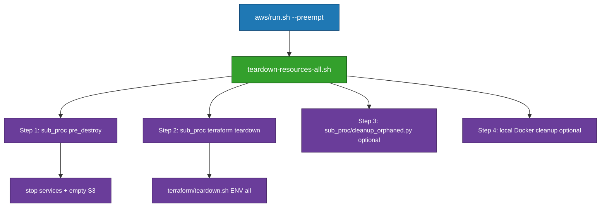

# AWS Teardown Scripts Reference

This document explains each teardown script, their purpose, usage, and relationships. Scripts are ordered from lowest-level (Terraform-specific) to highest-level (orchestrator).

---

## 1. terraform/teardown.sh

**Description**: Low-level Terraform/Terragrunt destroy wrapper. Destroys Terraform-managed infrastructure layers using `terragrunt destroy`, handling dependency ordering (application before infrastructure) and auto-confirming when `PREEMPT=true`.

**Usage**:
```bash
./run_scripts/main_application_scripts/aws/terraform/teardown.sh <ENVIRONMENT> <LAYER>
```

**Parameters**:
- `ENVIRONMENT`: `dev` or `prod`
- `LAYER`: `infrastructure` | `ecs` | `eks` | `all`

**Example**:
```bash
./run_scripts/main_application_scripts/aws/terraform/teardown.sh dev eks
```

**Relationships**:
- **Called by**: `teardown-resources-all.sh` (full teardown: single call with `LAYER=all` and `CONTAINER_TYPE` set). For **partial teardown**, call directly (see Partial teardown below).
- **Calls**: Terragrunt/Terraform directly
- **Note**: Only destroys Terraform-managed resources. Does not stop services, empty S3 buckets, or clean orphaned resources.

---

## 2. delete-recreatable-resources.sh

**Description**: Standalone CLI tool for "nuclear" teardown of all recreatable AWS resources for a specific environment. Deletes ECS clusters/services, ECR repositories (all images), S3 buckets (except state bucket), CloudFront distributions, ALB/ELB load balancers, VPC resources, and Aurora clusters. Preserves Secrets Manager secrets and Terraform state bucket.

**Usage**:
```bash
./run_scripts/main_application_scripts/aws/shared/cli/resource-removal/older/delete-recreatable-resources.sh <ENVIRONMENT> [--dry-run] [--skip-confirmation]
```

**Options**:
- `--dry-run`: Preview without deleting
- `--skip-confirmation`: Skip prompts (auto-confirms when `PREEMPT=true`)

**Example**:
```bash
./run_scripts/main_application_scripts/aws/shared/cli/resource-removal/older/delete-recreatable-resources.sh dev --skip-confirmation
```

**Relationships**:
- **Called by**: None (standalone CLI tool - run manually when needed)
- **Calls**: AWS CLI directly
- **Note**: This script is NOT called by teardown orchestrators. For automated teardown, use `teardown-resources-all.sh` which calls `resources_cleanup/sub_proc/cleanup_orphaned.py` (selective cleanup with retention policies) instead.

---

## 3. teardown-resources-all.sh

**Description**: Teardown orchestrator with three modes. **eks**: Destroy EKS app layer only (ECS and shared left standing). **ecs**: Destroy ECS app layer only (EKS and shared left standing). **all**: Destroy EKS + ECS app layers, then shared infrastructure (VPC, Aurora, IAM)—nothing left standing. Steps: (1) Pre-destroy (stop services, empty S3), (2) Terraform destroy (layer(s)), (3) Optional orphan cleanup, (4) Optional local Docker cleanup. If destroy fails (e.g. ENI eventual consistency), retry later or use `remove-all-aws-resources` as fallback (see README_TERRA_SH_RESPONSIBILITIES.md and [README_WAR_STORIES.md](../README_WAR_STORIES.md)). Preserves Secrets Manager secrets (lifecycle.prevent_destroy).

**Usage**:
```bash
./run_scripts/main_application_scripts/aws/shared/resources_cleanup/teardown-resources-all.sh <ENVIRONMENT> --container-type <eks|ecs|all> [OPTIONS]
```

**Required Parameters**:
- `ENVIRONMENT`: `dev`, `staging`, or `prod`
- `--container-type`: `eks` (EKS layer only) | `ecs` (ECS layer only) | `all` (EKS + ECS + shared)

**Options**:
- `--force`: Skip confirmation prompts
- `--dry-run`: Preview changes
- `--clean-local-only`: Only clean local Docker images (skip AWS teardown)

**Examples**:
```bash
./run_scripts/main_application_scripts/aws/shared/resources_cleanup/teardown-resources-all.sh dev --container-type eks --force   # EKS layer only
./run_scripts/main_application_scripts/aws/shared/resources_cleanup/teardown-resources-all.sh dev --container-type ecs --force   # ECS layer only
./run_scripts/main_application_scripts/aws/shared/resources_cleanup/teardown-resources-all.sh dev --container-type all --force   # Everything (EKS + ECS + shared)
```

**Relationships**:
- **Called by**: `aws/run.sh` (when `--preempt` flag is used)
- **Calls**: `sub_proc/<ecs|eks>_pre_destroy.py` (stop services, empty S3), `sub_proc/<ecs|eks>_terraform_teardown.sh` (calls `terraform/teardown.sh <ENV> all`), `sub_proc/cleanup_orphaned.py` (optional, after Terraform), local Docker cleanup (optional)
- **Architecture**: Pre-destroy (sub_proc Python) → Terraform destroy (sub_proc shell wrapper) → optional orphan cleanup (sub_proc Python) → optional local Docker. For partial teardown, call `terraform/teardown.sh` or sub_proc scripts directly (see below).

---

## 4. Partial teardown (call terraform/teardown.sh directly)

**No separate nonshared/shared scripts.** Use the same Terraform teardown script with the desired layer:

| Goal | Command | Notes |
|------|---------|--------|
| Container-only (ECS or EKS) | `terraform/teardown.sh <ENV> ecs` or `terraform/teardown.sh <ENV> eks` | Run **pre-destroy** first: `sub_proc/eks_pre_destroy.py` or `sub_proc/ecs_pre_destroy.py`, then the command. Optional: `sub_proc/cleanup_orphaned.py --container-type ecs\|eks --environment <ENV>`. |
| Shared-only (VPC, Aurora, IAM) | `terraform/teardown.sh <ENV> infrastructure` or `sub_proc/shared_terraform_teardown.sh <ENV>` | Only after container layers are gone. Optional: `sub_proc/cleanup_orphaned.py --environment <ENV>`. |
| Full teardown (everything) | `teardown-resources-all.sh <ENV> --container-type all` | Pre-destroy EKS + ECS, terraform destroy eks + ecs + infrastructure, optional orphan + local Docker. |
| EKS layer only | `teardown-resources-all.sh <ENV> --container-type eks` | Pre-destroy EKS, terraform destroy eks layer only. ECS and shared left standing. |
| ECS layer only | `teardown-resources-all.sh <ENV> --container-type ecs` | Pre-destroy ECS, terraform destroy ecs layer only. EKS and shared left standing. |

Set `PREEMPT=true` (or confirm at prompts) and `CONTAINER_TYPE=ecs` or `eks` when using `LAYER=all`.

---

## 5. aws/run.sh

**Description**: Main orchestrator script for AWS deployments. When `--preempt` is used, calls `teardown-resources-all.sh` to destroy all infrastructure before deployment, ensures non-interactive execution (auto-confirms all prompts), then proceeds with fresh deployment. Orchestrates complete deployment pipeline (teardown → infrastructure setup → application deployment → verification). Suitable for CI/CD pipelines.

**Usage**:
```bash
./run_scripts/main_application_scripts/aws/run.sh deploy --container-type <ecs|eks> <ENVIRONMENT> [--preempt] [--dry-run]
```

**Required Parameters**:
- `deploy`: Action (deploy, verify, etc.)
- `--container-type`: `ecs` or `eks`
- `ENVIRONMENT`: `dev`, `staging`, or `prod`

**Options**:
- `--preempt`: Destroy all infrastructure before deployment (calls `teardown-resources-all.sh`)
- `--dry-run`: Preview changes without modifying resources

**Example**:
```bash
./run_scripts/main_application_scripts/aws/run.sh deploy --container-type eks dev --preempt
```

**Relationships**:
- **Calls**: `teardown-resources-all.sh` (when `--preempt` is used)
- **Orchestrates**: Complete deployment pipeline

---

## Script Call Hierarchy

**Main flow (slim orchestrator):**



---

## Quick Reference

| Use Case | Script | Example |
|----------|--------|---------|
| Destroy everything (full teardown) | `teardown-resources-all.sh` | `teardown-resources-all.sh dev --container-type all --force` |
| Destroy EKS layer only | `teardown-resources-all.sh` | `teardown-resources-all.sh dev --container-type eks --force` |
| Destroy ECS layer only | `teardown-resources-all.sh` | `teardown-resources-all.sh dev --container-type ecs --force` |
| Destroy one layer only (partial) | `terraform/teardown.sh` | `terraform/teardown.sh dev eks` or `terraform/teardown.sh dev infrastructure` |
| Nuclear teardown (all recreatable resources) | `delete-recreatable-resources.sh` | `delete-recreatable-resources.sh dev --skip-confirmation` |
| Clean up orphaned resources only | `sub_proc/cleanup_orphaned.py` | `sub_proc/cleanup_orphaned.py --environment dev --container-type ecs --force` |
| Frontend bucket diagnostic | `cli/resource-check/reference_check_frontend_bucket.sh` | `reference_check_frontend_bucket.sh --environment dev` |
| Complete teardown + deploy | `aws/run.sh --preempt` | `aws/run.sh deploy --container-type eks dev --preempt` |

---

## Effect of --preempt Flag

When `--preempt` is used with `aws/run.sh`:

1. **Non-Interactive**: All confirmation prompts skipped (auto-confirmed)
2. **Complete Teardown**: Calls `teardown-resources-all.sh` which destroys container-type resources, shared infrastructure (VPC, Aurora, IAM), S3 buckets, local Docker images, and orphaned resources
3. **Fresh Deployment**: After teardown, proceeds with full deployment pipeline
4. **CI/CD Ready**: Suitable for automated pipelines (no manual intervention)

**Preserved**: Secrets Manager secrets (30-day recovery window), Terraform state bucket

**Example**:
```bash
./run_scripts/main_application_scripts/aws/run.sh deploy --container-type eks dev --preempt
```

---

## Analysis: Removing nonshared/shared and calling terraform/teardown directly

**Idea:** Remove `teardown-resources-nonshared.sh` and `teardown-resources-shared.sh` and have everyone call `terraform/teardown.sh` directly for partial or full teardown.

**What we did:** We removed both scripts. The flow is now:

| Need | What to run |
|------|-------------|
| **Full teardown** (EKS + ECS + shared + optional orphan + local Docker) | `teardown-resources-all.sh <ENV> --container-type all`. |
| **EKS layer only** (leave ECS and shared standing) | `teardown-resources-all.sh <ENV> --container-type eks`. |
| **ECS layer only** (leave EKS and shared standing) | `teardown-resources-all.sh <ENV> --container-type ecs`. |
| **Partial: manual** (pre-destroy + terraform by hand) | Pre-destroy: `sub_proc/eks_pre_destroy.py` or `sub_proc/ecs_pre_destroy.py`, then `terraform/teardown.sh <ENV> ecs` or `eks`. Optional: `sub_proc/cleanup_orphaned.py --container-type ecs\|eks --environment <ENV>`. |
| **Partial: shared-only** (VPC, Aurora, IAM) | `terraform/teardown.sh <ENV> infrastructure` or `sub_proc/shared_terraform_teardown.sh <ENV>`. Optional: `sub_proc/cleanup_orphaned.py --environment <ENV>`. |

**Pros of removing nonshared/shared:**

- **Less code:** ~1,150 lines removed (nonshared ~978, shared ~187). One less layer of wrappers.
- **Single source of truth:** Terraform teardown is the only place that runs `terragrunt destroy`; no duplicate logic in two scripts.
- **Simpler mental model:** Full teardown = one script (teardown-resources-all). Partial = `terraform/teardown.sh` + optional pre-destroy and orphan cleanup, documented in one table.
- **Easier maintenance:** Changes to destroy order or flags happen in `terraform/teardown.sh` and (for full flow) in `teardown-resources-all.sh` only.

**Cons / trade-offs:**

- **Partial teardown is more manual:** For container-only, users must run pre-destroy (stop services, empty S3) themselves or copy the steps from teardown-resources-all; we document the commands in the "Partial teardown" section. No one-line script for "tear down EKS only" that does pre-destroy + terraform + orphan.
- **Orphan cleanup is optional and explicit:** Shared-only teardown no longer auto-runs orphan cleanup; users run `sub_proc/cleanup_orphaned.py` explicitly if they want it.

**Conclusion:** Removing nonshared/shared is a net simplification. Full teardown stays one command (`teardown-resources-all.sh`). Partial teardown is "call `terraform/teardown.sh` with the right layer" plus documented pre-destroy and optional orphan steps. We accepted the trade-off of slightly more manual steps for partial teardown in exchange for less code and a single Terraform teardown entry point.

---

## Notes

- All scripts support `--dry-run` to preview changes
- Use `--force` to skip confirmation prompts (or rely on `PREEMPT=true` for non-interactive mode)
- Scripts are idempotent: safe to run multiple times
- Terraform state bucket is never destroyed (by design)
- Secrets Manager secrets are preserved (30-day recovery window)
