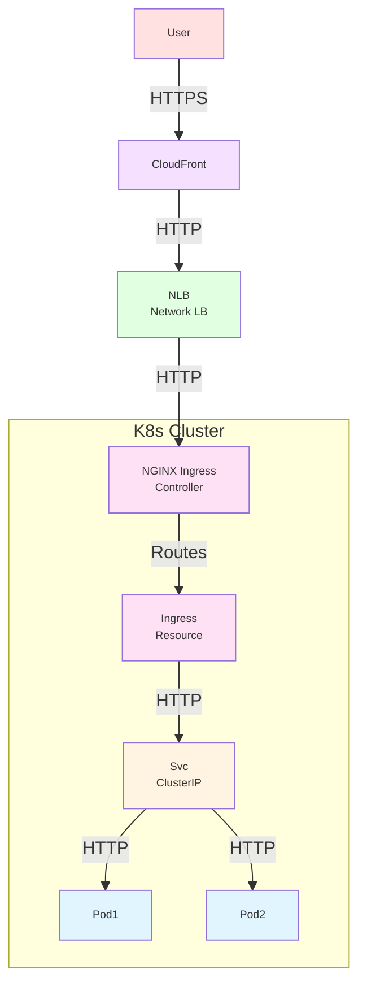
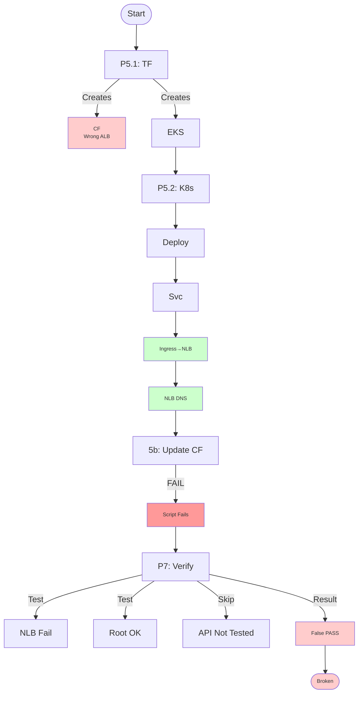
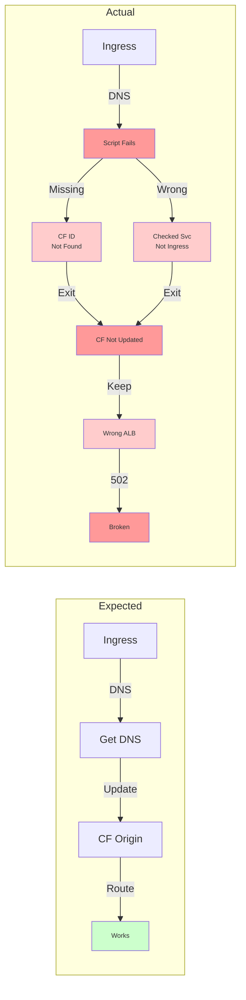
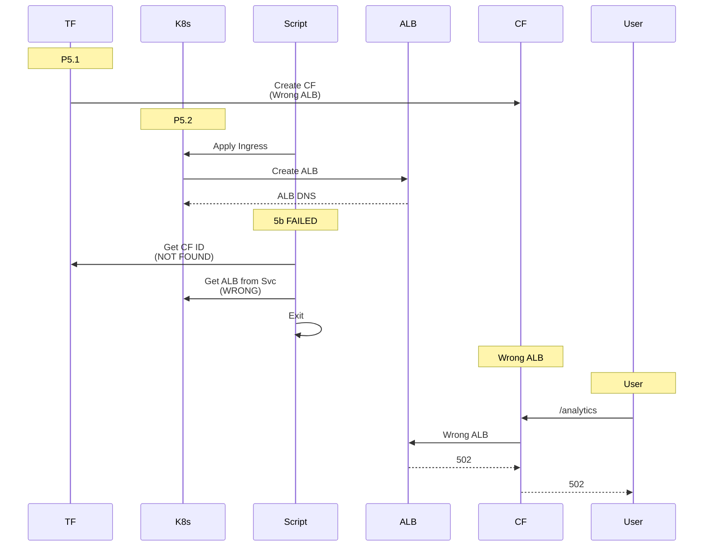
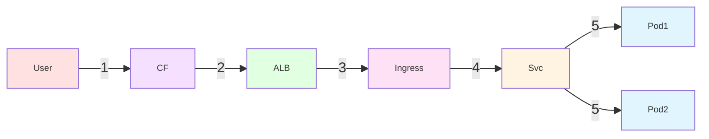
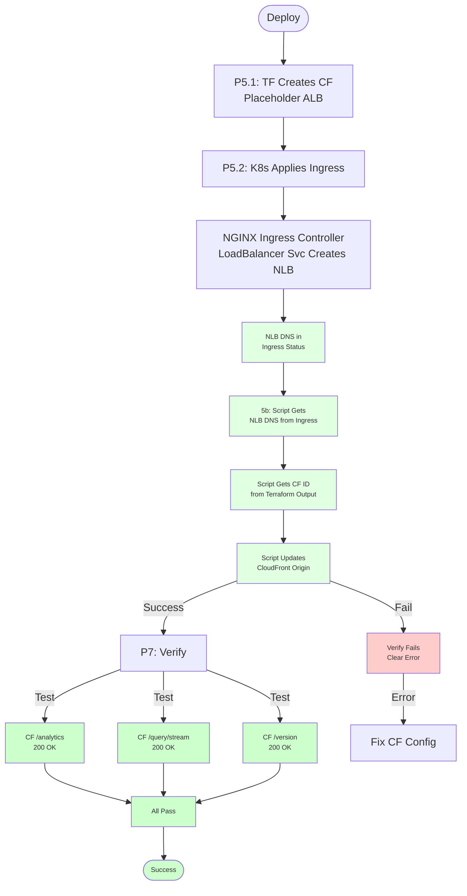

# EKS Deployment Workflow Analysis

## Part 1: Component Roles

### 1. Terraform/Terragrunt
- **Purpose**: Creates AWS infrastructure declaratively
- **Creates**: EKS cluster, CloudFront distribution, S3 bucket
- **Configuration**: `infra/terraform/providers/aws/environments/dev/eks/terragrunt.hcl`
- **Key Issue**: CloudFront origin ALB DNS was hardcoded with wrong value

### 2. Kubernetes Components



**Component Details:**

1. **Deployment** (`fru-api`)
   - Manages pod replicas (2 pods running)
   - Pods run the Flask backend application
   - **Location**: `infra/k8s/templates/deployment.template.yaml`

2. **Service** (`fru-api`, type: `ClusterIP`)
   - Internal cluster IP only, no external access
   - Routes traffic from Ingress to backend pods
   - **Location**: `infra/k8s/templates/service.template.yaml`

3. **Ingress Resource** (`fru-api-ingress-dev`)
   - Kubernetes Ingress resource that defines routing rules
   - Uses `ingressClassName: fru-nginx-cls` to route through NGINX Ingress Controller
   - Routes paths (`/query`, `/analytics`, `/health`, `/version`) to the `fru-api` Service
   - **Location**: `infra/k8s/templates/ingress.template.yaml`

4. **NGINX Ingress Controller**
   - Cloud-agnostic ingress controller running on dedicated node group
   - Installed via Helm (chart: `ingress-nginx/ingress-nginx`)
   - **How NLB is created on AWS:**
     - NGINX Ingress Controller has a LoadBalancer Service (`ingress-nginx-controller` in `ingress-nginx` namespace)
     - Service has AWS annotations that tell AWS to create an NLB:
       - `service.beta.kubernetes.io/aws-load-balancer-type: nlb`
       - `service.beta.kubernetes.io/aws-load-balancer-nlb-target-type: ip`
       - `service.beta.kubernetes.io/aws-load-balancer-scheme: internet-facing`
     - AWS automatically creates NLB when it sees these annotations
     - NLB DNS appears in the Service status
     - NGINX Ingress Controller copies this DNS to Ingress resource status
   - **Cloud-agnostic**: Same setup works on Azure/GCP (creates their respective load balancers)
   - **Note**: Helm values/annotations may be set during installation (not in codebase) or use default chart values

### 3. Shell Scripts
- **Purpose**: Orchestrate deployment workflow
- **Key Script**: `run_scripts/main_application_scripts/aws/eks/deploy.sh`
- **Critical Step**: Substep 5b - Update CloudFront after Ingress creates NLB

---

## Part 2: Deployment Workflow



### Workflow Steps

1. **Phase 5.1: Terraform Creates Infrastructure**
   - Creates EKS cluster
   - Creates CloudFront with hardcoded NLB DNS from `terragrunt.hcl` (❌ wrong value)
   - **Note**: CloudFront origin points to a load balancer (NLB on AWS), but the DNS was hardcoded incorrectly

2. **Phase 5.2: Kubernetes Manifests Applied**
   - Deployment → Pods start running
   - Service (ClusterIP) → Internal IP only, no external access
   - Ingress → NGINX Ingress Controller's LoadBalancer Service creates NLB on AWS
   - NLB DNS appears in Ingress status (populated by NGINX Ingress Controller)

3. **Substep 5b: CloudFront Update (❌ FAILED HERE)**
   - Script should:
     - Get CloudFront distribution ID from Terraform outputs
     - Get NLB DNS from Ingress: `kubectl get ingress -o jsonpath='{.status.loadBalancer.ingress[0].hostname}'`
     - Update CloudFront origin to use that NLB DNS
   - What went wrong:
     - ❌ Couldn't find `cloudfront_distribution_id` (not exposed in EKS outputs)
     - ❌ Script checked `kubectl get svc` instead of `kubectl get ingress`
     - ❌ Service is ClusterIP (no LoadBalancer hostname)
     - ❌ Script exited early with warning
     - ❌ CloudFront kept wrong hardcoded NLB DNS

### Industry Best Practices for CloudFront-ALB Coordination

**Current Approach (Shell Script with `kubectl`):**
- ✅ **Pros**: Simple, works after Kubernetes manifests are applied, can wait for Ingress to be ready
- ❌ **Cons**: Requires manual coordination, timing-dependent, not fully declarative

**Alternative 1: Terraform with `data.kubernetes_ingress`**
```hcl
data "kubernetes_ingress" "api" {
  metadata {
    name      = "fru-api-ingress"
    namespace = "default"
  }
  depends_on = [kubernetes_ingress.api]  # Wait for Ingress to be created
}

# Use ALB DNS from Ingress status
locals {
  alb_dns = data.kubernetes_ingress.api.status[0].load_balancer[0].ingress[0].hostname
}
```
- ✅ **Pros**: Fully declarative, Terraform manages dependencies
- ❌ **Cons**: **Timing issue**: Terraform runs BEFORE Kubernetes manifests are applied (Phase 5.1 vs 5.2)
- ❌ **Cons**: Requires two-phase Terraform apply (create Ingress first, then update CloudFront)
- ❌ **Cons**: Complex dependency management between Terraform and Kubernetes

**Alternative 2: Two-Phase Terraform Deployment**
1. Phase 1: Create EKS + Ingress (without CloudFront ALB origin)
2. Phase 2: Apply Kubernetes manifests, wait for Ingress ALB
3. Phase 3: Terraform apply again with `data.kubernetes_ingress` to update CloudFront
- ✅ **Pros**: Fully declarative, Terraform manages everything
- ❌ **Cons**: Requires multiple Terraform applies, complex workflow

**Alternative 3: AWS Load Balancer Controller + External-DNS**
- Use **AWS Load Balancer Controller** to automatically create ALB from Ingress
- Use **External-DNS** to automatically create Route53 records
- Use **EventBridge + Lambda** to automatically update CloudFront when ALB changes
- ✅ **Pros**: Fully automated, no manual coordination, industry standard for AWS-only deployments
- ❌ **Cons**: Requires additional controllers, more complex initial setup
- ⚠️ **Cloud-Agnostic Concern**: **Contradicts cloud-agnostic goal**
  - Your architecture uses **NGINX Ingress Controller on dedicated node group** to remain cloud-agnostic
  - This allows the same Kubernetes manifests to work on **AWS, Azure, GCP** without changes
  - AWS Load Balancer Controller is **AWS-specific** (creates ALB, not generic LoadBalancer)
  - Would lock you into AWS and prevent easy migration to Azure/GCP
  - **Not recommended** for your use case due to cloud-agnostic requirement
  - **Note**: NGINX Ingress Controller on AWS automatically creates ALB (cloud-agnostic controller, cloud-specific LB)

**Alternative 4: Terraform `null_resource` with `local-exec` (Hybrid)**
```hcl
resource "null_resource" "update_cloudfront" {
  depends_on = [kubernetes_ingress.api]
  
  triggers = {
    ingress_uid = kubernetes_ingress.api.metadata[0].uid
  }
  
  provisioner "local-exec" {
    command = <<-EOT
      kubectl get ingress fru-api-ingress -n default -o jsonpath='{.status.loadBalancer.ingress[0].hostname}' > /tmp/alb_dns.txt
      # Update CloudFront using AWS CLI
    EOT
  }
}
```
- ✅ **Pros**: Terraform-managed, can wait for Ingress
- ❌ **Cons**: Still requires `kubectl`, not fully declarative

**Recommended Approach for This Project:**
**Keep the current shell script approach** but improve it:
1. ✅ Fix the script to check `kubectl get ingress` (not Service) - **DONE**
2. ✅ Expose `cloudfront_distribution_id` in Terraform outputs - **DONE** (added to EKS module outputs)
3. ✅ Add proper retry logic with timeout - **Already has this**
4. ✅ Make it fail-fast with clear error messages - **Already improved**
5. ⚠️ Consider moving to Terraform `null_resource` for better integration - **Optional future improvement**

**Why Shell Script is Acceptable:**
- Kubernetes Ingress NLB creation is **asynchronous** (AWS creates it after NGINX Ingress Controller Service is created)
- Terraform runs **before** Kubernetes manifests (Phase 5.1 vs 5.2)
- Shell script can **wait and retry** until Ingress NLB DNS is ready
- This is a **common pattern** for coordinating Terraform and Kubernetes resources
- ✅ **Maintains cloud-agnostic architecture**: Uses standard Kubernetes Ingress (works on any cloud)

**Cloud-Agnostic Architecture Note:**
- Your setup uses **NGINX Ingress Controller on a dedicated node group** (not Fargate)
- This allows the same Kubernetes manifests to work on **AWS, Azure, GCP** without changes
- The Ingress resource is **cloud-agnostic** - AWS Load Balancer Controller creates ALB automatically
- Shell script approach **preserves this cloud-agnostic design** (no AWS-specific controllers required)

4. **Phase 7: Verification (❌ False Positive)**
   - Tested direct ALB (failed - HTTPS/HTTP mismatch)
   - Tested frontend root (passed - S3 static files)
   - ❌ Did NOT test CloudFront API endpoints
   - Marked as "PASSED" despite CloudFront misconfiguration

---

## Part 3: The Problem Location



### Root Causes

1. **Missing Terraform Output**
   - `cloudfront_distribution_id` not exposed in EKS module outputs
   - Script couldn't find CloudFront distribution to update

2. **Wrong Resource Check**
   - Script checked: `kubectl get svc` (Service)
   - Should check: `kubectl get ingress` (Ingress)
   - Service is ClusterIP → no LoadBalancer hostname
   - Ingress has NLB hostname in status

3. **Hardcoded Fallback**
   - `terragrunt.hcl` had wrong NLB DNS as fallback
   - CloudFront created with wrong origin from start

### Result
- CloudFront kept pointing to non-existent NLB → **502 Bad Gateway errors**
- Frontend couldn't reach backend through CloudFront

---

## Part 4: Component Interaction Details



### Traffic Flow (When Working)



---

## Part 5: The Fix

### What Was Fixed

1. **Manual Fix**
   - Updated `terragrunt.hcl` with correct ALB DNS
   - Re-applied Terraform to update CloudFront

2. **Code Fixes**
   - Added CloudFront API endpoint validation (`/analytics`, `/query/stream`)
   - Made verification fail-fast on critical failures
   - Would catch this issue in future deployments

### Fixed Workflow



---

## Summary

**Problem Location**: Substep 5b - CloudFront update script failed silently

**Root Causes**:
1. Missing Terraform output (`cloudfront_distribution_id`)
2. Wrong resource check (Service instead of Ingress)
3. Hardcoded wrong ALB DNS in config

**Impact**: CloudFront pointed to wrong ALB → 502 errors on frontend

**Solution**: 
- Fixed CloudFront origin manually
- Added CloudFront API validation
- Made verification fail-fast
- Exposed `cloudfront_distribution_id` in Terraform outputs
- Fixed script to check Ingress (not Service) for ALB DNS

### Approach Comparison

| Approach | Declarative | Timing | Complexity | Cloud-Agnostic | Recommendation |
|----------|-------------|--------|------------|----------------|----------------|
| **Shell Script** (current) | ❌ | ✅ | ✅ Low | ✅ **Yes** | ✅ **Keep & improve** |
| **Terraform `data.kubernetes_ingress`** | ✅ | ❌ Needs 2-phase | ⚠️ Medium | ✅ Yes | ⚠️ Possible but complex |
| **Terraform `null_resource`** | ⚠️ Partial | ✅ | ⚠️ Medium | ✅ Yes | ⚠️ Alternative |
| **AWS Controllers** | ✅ | ✅ | ❌ High | ❌ **No (AWS-only)** | ❌ **Not recommended** |

**Key Insight**: Your architecture prioritizes **cloud-agnostic design** (NGINX Ingress on node group), so AWS-specific controllers would contradict this goal. The shell script approach maintains cloud portability while solving the coordination problem.
