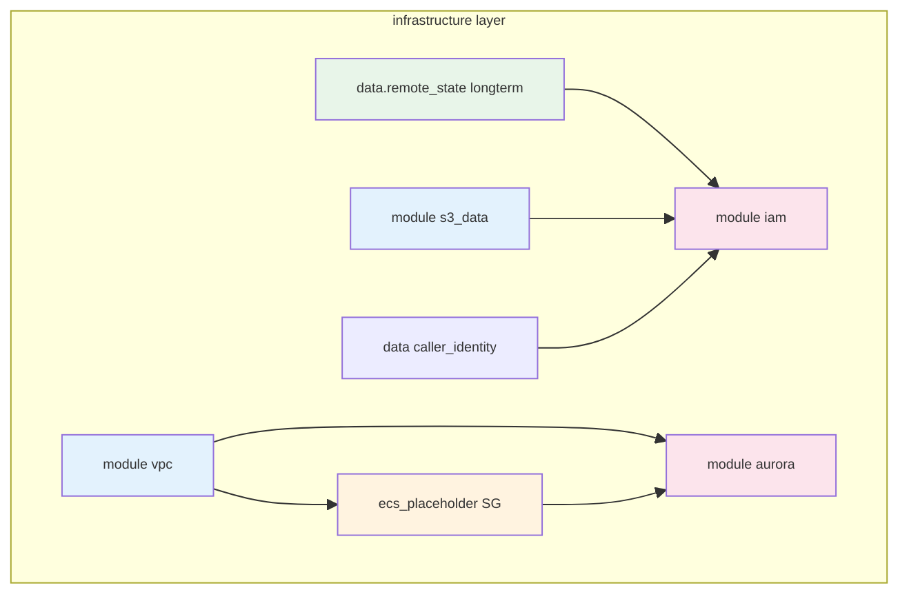
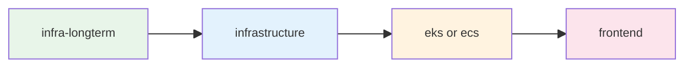
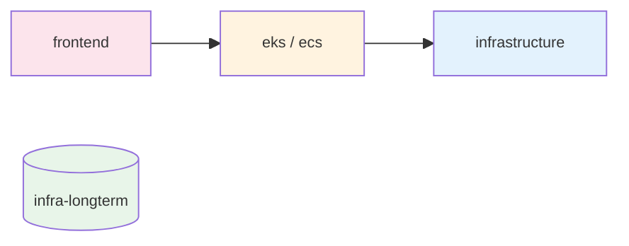
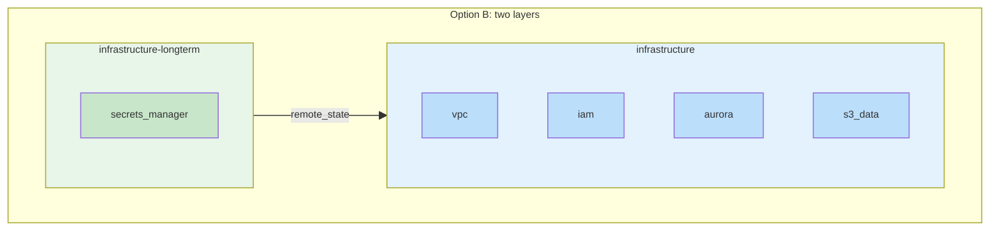

# Terraform “Layers” Crash Course

A short guide to what we mean by **layers** in Terraform/Terragrunt in this repo, how **deployment order** is determined, and how that connects to **long-term components** (e.g. Secrets Manager) and **Option B: separate long-term layer**.

**See also:** [VPC_LEARNED.md](VPC_LEARNED.md) (VPC + state + locks; [§3.2 Option B — Import](VPC_LEARNED.md#32-how-we-fix-it-align-state-and-reality) for fixing subnet group by importing), [DEPLOYMENT_ERRORS_AND_FIXES.md](../DEPLOYMENT_ERRORS_AND_FIXES.md), [README_WAR_STORIES.md](../../README_WAR_STORIES.md).

---

## 1. What is a “layer”?

In this repo, a **layer** is **one unit of Terraform/Terragrunt that we apply or destroy as a single step**. It has:

- **One directory** with a `terragrunt.hcl` (and usually a Terraform module or `source`).
- **One remote state file** (e.g. in S3: `dev/infrastructure/terraform.tfstate`, `dev/eks/terraform.tfstate`).
- **One `terragrunt apply` or `terragrunt destroy`** = one layer.

So when we say “destroy the infrastructure layer,” we mean: run `terragrunt destroy` in that layer’s directory; everything in that layer’s state is destroyed together.

**Layers are not** the same as **modules**. A **module** is a reusable `.tf` folder (e.g. `modules/secrets-manager`, `modules/vpc`). One **layer** can use **many modules**. With **Option B**, the **infrastructure** layer uses: `data.terraform_remote_state.longterm`, `vpc`, `iam`, `aurora`, `s3_data` (no `secrets_manager`; that lives in **infrastructure-longterm**).

```text
Layer (one apply/destroy, one state)
  └── module_infra_basic/aws/terra/environments/dev/infrastructure/
        terragrunt.hcl  →  source = modules//infrastructure
        modules/infrastructure/main.tf
          ├── data "terraform_remote_state" "longterm"
          ├── module "vpc"
          ├── module "iam"   (uses longterm outputs + s3_data)
          ├── module "aurora"
          └── module "s3_data"
```

---

## 2. How is deployment order determined?

### 2.1 Order **among layers**

Layer order is **not** driven by Terragrunt `dependency` blocks. It is **explicit sequence** in `orchestration/terraform/deploy.sh`: the script runs a fixed sequence of `if` blocks and, for each layer, does `cd` → (optional import) → `terragrunt refresh` → `terragrunt plan` → `terragrunt apply`.

- **When `LAYER=all`** (full deploy), the script:
  1. Applies **infrastructure-longterm** (if that directory exists), then **infrastructure** — so the infrastructure layer can read longterm state.
  2. Then, depending on **`CONTAINER_TYPE`** (set by `./run.sh aws kube …` or `./run.sh aws nonkube …`):
     - **`CONTAINER_TYPE=eks`**: **eks** → **frontend-eks**
     - **`CONTAINER_TYPE=ecs`**: **ecs** → **frontend-ecs**
- **When `LAYER`** is a single layer (e.g. `infrastructure`, `eks`, `frontend-eks`), only that block runs; dependency on other layers is **assumed already deployed** (or you run deploy in the right order manually).

So: **longterm before infrastructure** (so `terraform_remote_state` works), **infrastructure before app** (EKS/ECS need VPC/subnets), **app before frontend** (frontend can reference app outputs if needed).

### 2.2 Order **within the same layer**

Within one layer we run a **single** `terragrunt apply`. Terraform decides the order of creates/updates from its **dependency graph**: resources and modules are applied in an order consistent with `depends_on` and with **references** (e.g. `module.aurora` depending on `module.vpc.vpc_id`). The deploy script does **not** sequence resources inside a layer — Terraform does.

Example **infrastructure** layer: `data.terraform_remote_state.longterm` and `data.aws_caller_identity.current` have no in-layer dependencies; `vpc` and `s3_data` have none; `aws_security_group.ecs_placeholder` depends on `vpc`; `iam` depends on longterm outputs and `s3_data`; `aurora` depends on `vpc` and `ecs_placeholder`. So the effective order is: longterm (read) + vpc + s3_data + caller_identity → ecs_placeholder → iam and aurora (parallel where possible).

**Within infrastructure layer (Terraform dependency order):**



---

## 3. Why layers matter for teardown

- **Apply:** We run apply **per layer** (e.g. infrastructure-longterm, infrastructure, then eks/ecs, then frontend). Order is fixed in `deploy.sh` (see §2.1).
- **Destroy:** We run destroy **per layer**, in **reverse** order (frontend first, then app, then infrastructure). Everything in that layer’s state is destroyed in one go. **infrastructure-longterm** is never destroyed by main teardown (Option B).

So “what gets destroyed” is decided by **which layers we run destroy on**. If Secrets Manager lived **inside** the infrastructure layer (as a module), destroying that layer would try to destroy secrets too — unless we block it (e.g. `prevent_destroy`) or **exclude it from that layer** (Option B).

**Deploy flow (layers):**



**Teardown flow (reverse; longterm never destroyed):**



*Main teardown never runs destroy on **infra-longterm**; that layer is left intact.*

---

## 4. Long-term components and “Option B”: separate long-term layer

Some AWS resources have **long-term** or **cool-off** behavior (e.g. Secrets Manager: 7–30 day recovery window, name reserved after delete). We don’t want **normal teardown** (including `teardown.sh aws all`) to delete them.

**Two ways to achieve “teardown never deletes long-term components”:**

| Approach | Idea | Pros / cons |
|----------|------|-------------|
| **Fail-back (current)** | Keep long-term resources in the **same** layer (e.g. infrastructure). Use `prevent_destroy` so destroy fails; then **state rm** those resources and run destroy again so only the rest (VPC, Aurora, etc.) are destroyed. | No Terraform refactor. One layer, one place to maintain. Teardown script has extra logic (state rm + second destroy). |
| **Option B: separate long-term layer** | Put long-term components (e.g. Secrets Manager) in a **separate Terragrunt layer** (e.g. `infrastructure-longterm` or `secrets`). That layer has its **own** state and its **own** directory. **Deploy:** apply both `infrastructure` and `infrastructure-longterm`. **Teardown:** only destroy `infrastructure`; **never** destroy `infrastructure-longterm` in the main flow. Optional: a dedicated `teardown-longterm.sh` to destroy that layer when explicitly needed. | Teardown logic stays simple: “destroy layer X” never touches the long-term layer. Clear split: “ephemeral infra” vs “long-term.” Requires refactor: new layer dir, move secrets out of infrastructure module, wire deploy/teardown. |

**Option B in one picture:**



```text
Today (one layer):
  infrastructure (one state)
    ├── vpc, aurora, iam, s3_data, secrets_manager
    └── destroy infrastructure  →  would destroy secrets too (we use state rm + re-destroy to avoid that)

Option B (two layers):
  infrastructure          (state: dev/infrastructure)
    ├── vpc, aurora, iam, s3_data
    └── teardown destroys this only  →  secrets never in plan

  infrastructure-longterm (state: dev/infrastructure-longterm)
    └── secrets_manager
    └── main teardown never runs destroy here
    └── teardown-longterm.sh can destroy this when explicitly requested
```

So **“layers”** are the knobs we turn to decide **what is applied together** and **what is destroyed together**. Putting long-term components in a **separate layer** that we **never** destroy in the main flow is the clean way to “never delete Secrets Manager in teardown” without `prevent_destroy` or state-rm logic.

**Implemented:** The repo uses **Option B**. The **infrastructure-longterm** layer (Secrets Manager only) is applied first on deploy and is **never** destroyed by main teardown. The **infrastructure** layer (VPC, Aurora, IAM, S3) reads secret ARNs via `terraform_remote_state` and is destroyed in one pass on teardown.

---

## 5. Quick reference

| Term | Meaning |
|------|--------|
| **Layer** | One Terragrunt directory, one state file, one `apply`/`destroy` unit. |
| **Module** | Reusable Terraform code under `modules/`. A layer can use several modules. |
| **Deploy order (layers)** | Fixed in `orchestration/terraform/deploy.sh`: longterm → infrastructure → (eks or ecs) → frontend; app branch chosen by `CONTAINER_TYPE` when `LAYER=all`. |
| **Order within a layer** | Terraform dependency graph (references and `depends_on`); one `terragrunt apply` per layer. |
| **Option B** | Separate Terragrunt layer for long-term resources (e.g. secrets); main teardown never destroys that layer; optional dedicated `teardown-longterm.sh`. *(The VPC/subnet “Option B — Import” is a different idea; see [VPC_LEARNED.md §3.2](VPC_LEARNED.md#32-how-we-fix-it-align-state-and-reality).)* |
| **Fail-back** | *(Legacy)* When destroy failed on `prevent_destroy`, we used to remove protected resources from state and re-run destroy. With Option B, infrastructure no longer contains Secrets Manager, so this is no longer used. |

---

*This doc: `docs/learned/TERRA_LEARNED.md`. Related: [VPC_LEARNED.md](VPC_LEARNED.md), [DEPLOYMENT_ERRORS_AND_FIXES.md](../DEPLOYMENT_ERRORS_AND_FIXES.md), [README_WAR_STORIES.md](../../README_WAR_STORIES.md).*
