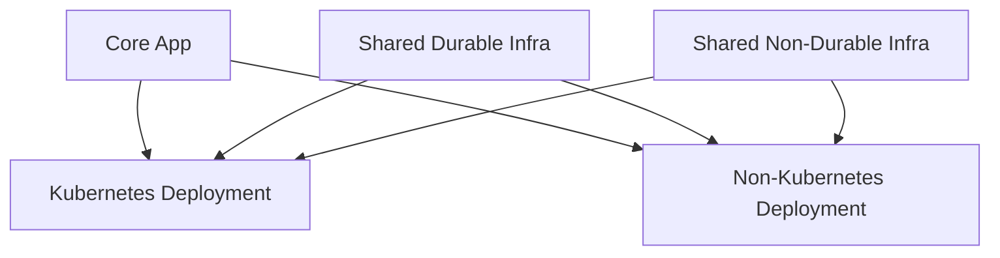

# Umbrella Infrastructure & Deployment Project

## 1. Purpose

This repository is an **umbrella project**, not a single application or deployable unit.

Its primary design goal is to **separate intent from deployment mechanism**:

- *Intent*: what the system is and what capabilities it needs
- *Mechanism*: how and where those capabilities are deployed (kube, non-kube, cloud provider)

This separation allows:
- predictable blast radii
- safe teardown
- multi-cloud extensibility
- reduced scripting glue
- alignment with modern IaC best practices

---

## 2. Conceptual Overview



---

## 3. Repository Structure (High Level)

```text
.
├── core-app/                     # Deployment-agnostic application code
├── infra-modules/                # Reusable OpenTofu/Terraform primitives
├── deploy-aws-shared-durable/    # Rarely destroyed AWS infra
├── deploy-aws-shared-nondurable/ # Frequently destroyed AWS infra
├── deploy-aws-kube/              # AWS Kubernetes-based deployment
├── deploy-aws-nonkube/           # AWS ECS / native deployment
├── tools/                        # Thin orchestration wrappers
├── README.md
├── README_REFACTOR_LEARNED.md
├── REFACTOR_PLAN.md
```

---

## 4. Entry Points

There is **no single global entrypoint**.

Each sub-project is independently deployable, but `tools/` provides thin wrappers for convenience.

Example:

```bash
python tools/deploy-orchestrator-aws.py --scope kube --env dev
python tools/teardown-orchestrator-aws.py --scope all --env dev
```

---

## 5. Key Design Principle

> Deployment safety comes from **structure**, not scripts.

Scripts exist only to:
- orchestrate order
- pass configuration
- enforce guardrails

All real state lives in OpenTofu/Terraform.
