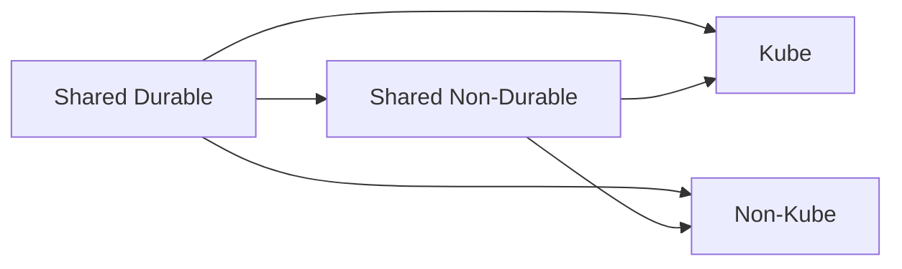

# README_REFACTOR_LEARNED

## 1. Introduction

This document captures **lessons learned** during the overhaul of a complex, multi-dimensional deployment system.

The legacy system worked, but accumulated:
- excessive orchestration scripts
- implicit coupling
- unclear blast radii
- high cognitive load

The refactor focuses on **clarity, safety, and extensibility**.

---

## 2. Durability vs Ownership Are Orthogonal

Two independent dimensions were identified:

### 2.1 Durability

- **Durable**: rarely destroyed, explicit teardown required
- **Non-durable**: frequently destroyed, safe to recreate

Examples:
- Durable: Secrets Manager, IAM roots, base networking
- Non-durable: clusters, services, task definitions

### 2.2 Ownership

- Shared
- Kube-specific
- Non-kube-specific

These dimensions must never be conflated.

---

## 3. Durable vs Non-Durable Teardown Strategy

### Rules:
1. Durable stacks are **never destroyed implicitly**
2. Non-durable stacks may depend on durable stacks
3. Durable stacks may not depend on non-durable stacks
4. Teardown scope must be explicit

This ensures:
- kube teardown does not impact non-kube
- non-kube teardown does not impact kube
- shared durable infra survives both

---

## 4. State Reconciliation & Reality Drift

### 4.1 The Problem

The system cannot assume:
- Terraform/OpenTofu state is authoritative
- Cloud state is untouched

The **nuclear cleanup script may run at any time**.

### 4.2 The Solution

We must support:
- re-importing resources
- rehydrating state
- reconciling partial reality

This implies:
- stable naming
- predictable IDs
- import-friendly module boundaries

State recovery is a **first-class requirement**, not an edge case.

---

## 5. Scripts Are Not the Enemy (But Must Be Thin)

Lessons learned:
- Bash is brittle at scale
- Python is better for orchestration
- Scripts must not encode infra logic

Correct usage:
- ordering
- argument passing
- guardrails

Incorrect usage:
- conditional infra decisions
- resource discovery
- lifecycle ownership

---

## 6. Intent vs Mechanism

The single most important insight:

> **Separate what the system is from how it is deployed.**

This drove:
- core-app isolation
- multiple deployment projects
- no global entrypoint
- safer evolution paths

This principle underpins the entire redesign.
