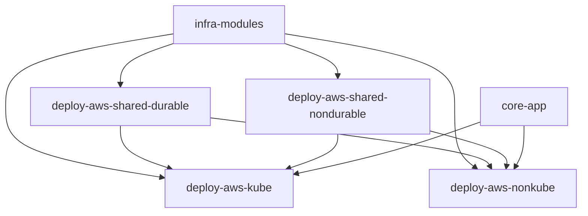

# REFACTOR_PLAN

## 1. Objective

Perform a **behavior-preserving refactor** of the existing system while:
- reducing script glue
- improving safety
- increasing extensibility
- aligning with IaC best practices

---

## 2. Non-Goals

- No functional changes to the core application
- No forced multi-cloud support in phase 1
- No optimization for minimal infra cost

---

## 3. Target Architecture

---

## 4. Phased Execution

### Phase 1: Structure
- Create umbrella layout
- Extract core-app
- Define infra module boundaries

### Phase 2: Shared Infra
- Implement shared-durable
- Implement shared-nondurable
- Ensure importability

### Phase 3: Deployment Targets
- Implement kube project (EKS)
- Implement non-kube project (ECS)

### Phase 4: Orchestration
- Add thin Python orchestrators
- Enforce scope-based teardown rules

---

## 5. Tooling Decisions

- OpenTofu-compatible Terraform
- Python for orchestration
- Minimal Bash for local glue
- `.env` as single source of configuration truth

---

## 6. Success Criteria

- One-command deploy per target
- Safe partial teardown
- Recoverable state after nuclear cleanup
- Clear mental model for new contributors
