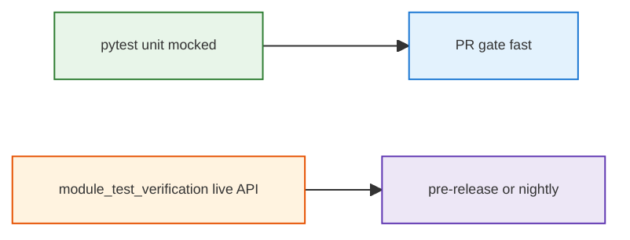

# Unit tests (pytest)

Fast, mocked unit tests for `module_app_core/backend`. Integration query tests live under `module_test_verification/`.

## Run

```bash
# From repo root
pip install -r requirements-dev.txt
pytest
# or
./scripts/run_unit_tests.sh
```

Coverage (current gate **42%** on `module_app_core/backend`, target **80%** per refactor plan):

```bash
./scripts/run_unit_tests.sh
# or: coverage run -m pytest && coverage html
```

## Layers

| Layer | Location | When |
|-------|----------|------|
| Unit | `tests/` | Every PR; mocked DB/LLM/OpenAI |
| Integration | `module_test_verification/test_query_*.sh` | Local/AWS with running API |



## Traceability (unit ↔ integration)

| Integration query | Code path exercised in unit tests |
|-------------------|-----------------------------------|
| `1_AVG` (average rating) | `validate_query`, `is_qualitative`, agent `execute_sql` / legacy `/query` mocks |
| `1_TOP` | SQL tool validation, quantitative keyword routing |
| `9` / stream variants | `/query/stream` error path when agent disabled |

## Markers

- Default: `-m "not integration"` (see `pytest.ini`)
- `@pytest.mark.integration` — reserved for future live-stack tests
